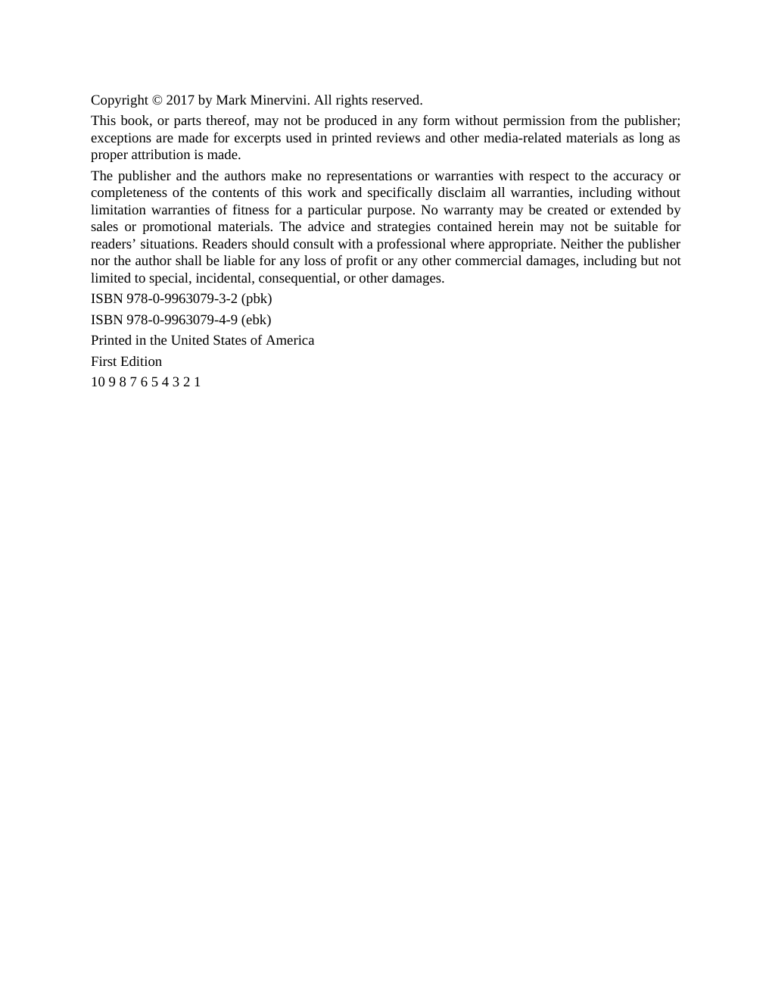

# Think and Trade Like a Champion - Page Image 4

## Source Page

Book: [[Think and Trade Like a Champion]]

## Page Read

Tags: text-or-context-page

Concepts: [[Mental Discipline]]

This page is mainly text/context. It is included so the image index has complete source coverage, but it should not be treated as an independent chart pattern.

## Linked Stock Figures

- No extracted stock-figure case on this page.

## Extracted Page Text Signal

Copyright © 2017 by Mark Minervini. All rights reserved. This book, or parts thereof, may not be produced in any form without permission from the publisher; exceptions are made for excerpts used in printed reviews and other media-related materials as long as proper attribution is made. The publisher and the authors make no representations or warranties with respect to the accuracy or completeness of the contents of this work and specifically disclaim all warranties, including without limitation ...

## Manual Study Prompt

- What visual structure is the page trying to make obvious?
- Is the lesson about buying, avoiding, selling, or managing risk?
- If a ticker is not present, what generic behavior does the image teach?
- If a ticker is present, does the linked OHLCV rebuild confirm the same behavior?
