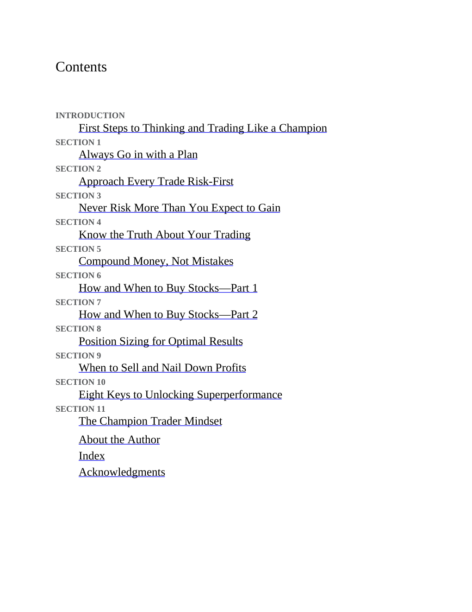

# Think and Trade Like a Champion - Page Image 5

## Source Page

Book: [[Think and Trade Like a Champion]]

## Page Read

Tags: mental-discipline, risk-first, sell-or-failure, visual-concept-page

Concepts: [[Mental Discipline]], [[Risk First]], [[Sell Rules and Failure Signals]]

This is a visual teaching page without a clean ticker/date case. The useful work is to read the image as a concept illustration rather than forcing a market-data reconstruction.

## Linked Stock Figures

- No extracted stock-figure case on this page.

## Extracted Page Text Signal

Contents INTRODUCTION First Steps to Thinking and Trading Like a Champion SECTION 1 Always Go in with a Plan SECTION 2 Approach Every Trade Risk-First SECTION 3 Never Risk More Than You Expect to Gain SECTION 4 Know the Truth About Your Trading SECTION 5 Compound Money, Not Mistakes SECTION 6 How and When to Buy Stocks-Part 1 SECTION 7 How and When to Buy Stocks-Part 2 SECTION 8 Position Sizing for Optimal Results SECTION 9 When to Sell and Nail Down Profits SECTION 10 Eight Keys to Unlocking Su...

## Manual Study Prompt

- What visual structure is the page trying to make obvious?
- Is the lesson about buying, avoiding, selling, or managing risk?
- If a ticker is not present, what generic behavior does the image teach?
- If a ticker is present, does the linked OHLCV rebuild confirm the same behavior?
