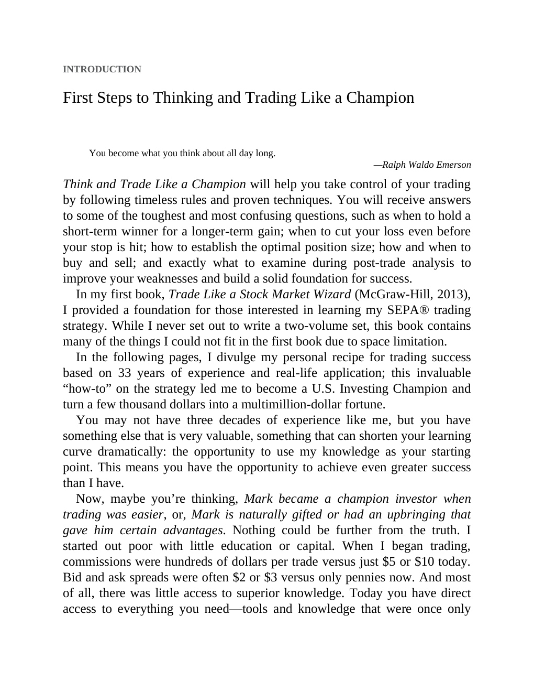

# Think and Trade Like a Champion - Page Image 6

## Source Page

Book: [[Think and Trade Like a Champion]]

## Page Read

Tags: risk-first, sell-or-failure, text-or-context-page, volume-behavior

Concepts: [[Risk First]], [[Sell Rules and Failure Signals]], [[Volume Dry-Up and Accumulation]]

This page is mainly text/context. It is included so the image index has complete source coverage, but it should not be treated as an independent chart pattern.

## Linked Stock Figures

- No extracted stock-figure case on this page.

## Extracted Page Text Signal

INTRODUCTION First Steps to Thinking and Trading Like a Champion You become what you think about all day long. -Ralph Waldo Emerson Think and Trade Like a Champion will help you take control of your trading by following timeless rules and proven techniques. You will receive answers to some of the toughest and most confusing questions, such as when to hold a short-term winner for a longer-term gain; when to cut your loss even before your stop is hit; how to establish the optimal position size; ho...

## Manual Study Prompt

- What visual structure is the page trying to make obvious?
- Is the lesson about buying, avoiding, selling, or managing risk?
- If a ticker is not present, what generic behavior does the image teach?
- If a ticker is present, does the linked OHLCV rebuild confirm the same behavior?
