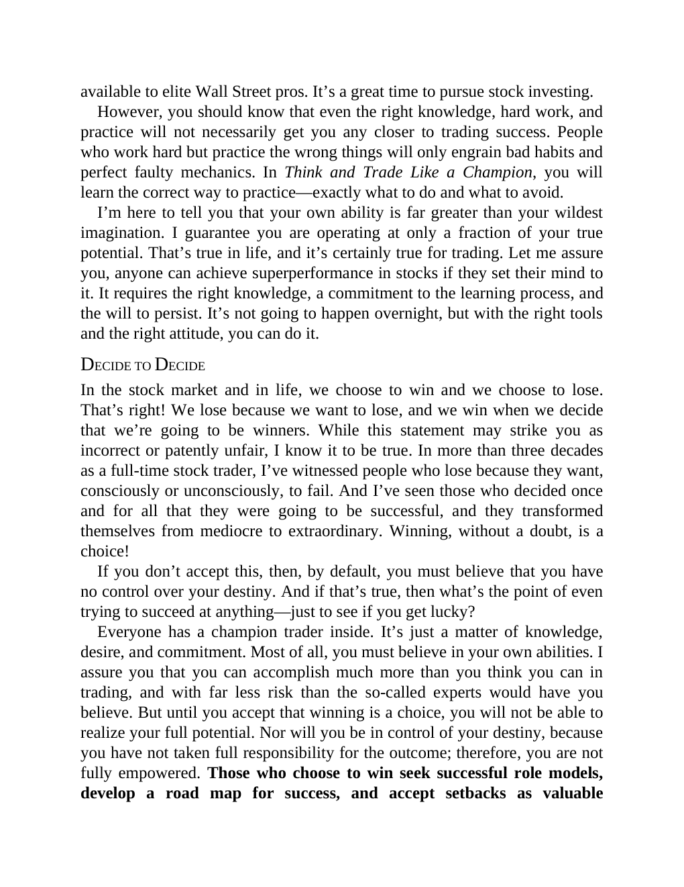

# Think and Trade Like a Champion - Page Image 7

## Source Page

Book: [[Think and Trade Like a Champion]]

## Page Read

Tags: text-or-context-page

Concepts: [[Mental Discipline]]

This page is mainly text/context. It is included so the image index has complete source coverage, but it should not be treated as an independent chart pattern.

## Linked Stock Figures

- No extracted stock-figure case on this page.

## Extracted Page Text Signal

available to elite Wall Street pros. It’s a great time to pursue stock investing. However, you should know that even the right knowledge, hard work, and practice will not necessarily get you any closer to trading success. People who work hard but practice the wrong things will only engrain bad habits and perfect faulty mechanics. In Think and Trade Like a Champion, you will learn the correct way to practice-exactly what to do and what to avoid. I’m here to tell you that your own ability is far g...

## Manual Study Prompt

- What visual structure is the page trying to make obvious?
- Is the lesson about buying, avoiding, selling, or managing risk?
- If a ticker is not present, what generic behavior does the image teach?
- If a ticker is present, does the linked OHLCV rebuild confirm the same behavior?
