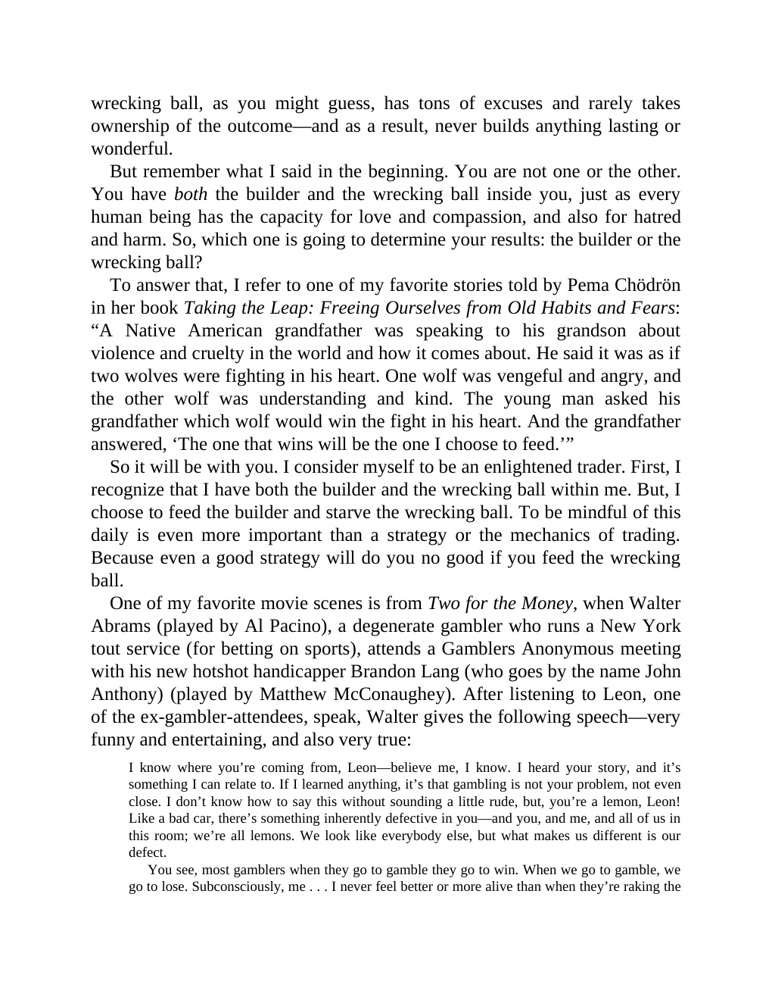

# Think and Trade Like a Champion - Page Image 9

## Source Page

Book: [[Think and Trade Like a Champion]]

## Page Read

Tags: text-or-context-page

Concepts: [[Mental Discipline]]

This page is mainly text/context. It is included so the image index has complete source coverage, but it should not be treated as an independent chart pattern.

## Linked Stock Figures

- No extracted stock-figure case on this page.

## Extracted Page Text Signal

wrecking ball, as you might guess, has tons of excuses and rarely takes ownership of the outcome-and as a result, never builds anything lasting or wonderful. But remember what I said in the beginning. You are not one or the other. You have both the builder and the wrecking ball inside you, just as every human being has the capacity for love and compassion, and also for hatred and harm. So, which one is going to determine your results: the builder or the wrecking ball? To answer that, I refer to ...

## Manual Study Prompt

- What visual structure is the page trying to make obvious?
- Is the lesson about buying, avoiding, selling, or managing risk?
- If a ticker is not present, what generic behavior does the image teach?
- If a ticker is present, does the linked OHLCV rebuild confirm the same behavior?
