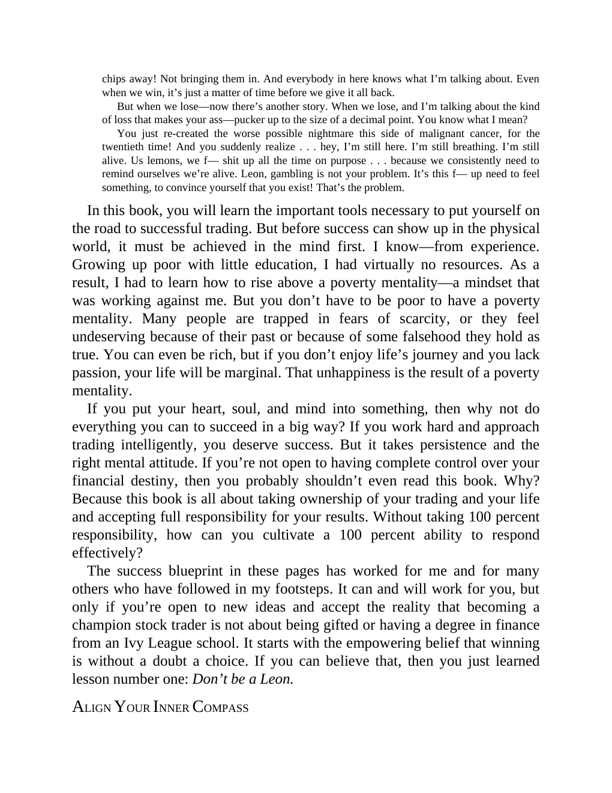

# Think and Trade Like a Champion - Page Image 10

## Source Page

Book: [[Think and Trade Like a Champion]]

## Page Read

Tags: text-or-context-page

Concepts: [[Mental Discipline]]

This page is mainly text/context. It is included so the image index has complete source coverage, but it should not be treated as an independent chart pattern.

## Linked Stock Figures

- No extracted stock-figure case on this page.

## Extracted Page Text Signal

chips away! Not bringing them in. And everybody in here knows what I’m talking about. Even when we win, it’s just a matter of time before we give it all back. But when we lose-now there’s another story. When we lose, and I’m talking about the kind of loss that makes your ass-pucker up to the size of a decimal point. You know what I mean? You just re-created the worse possible nightmare this side of malignant cancer, for the twentieth time! And you suddenly realize . . . hey, I’m still here. I’m ...

## Manual Study Prompt

- What visual structure is the page trying to make obvious?
- Is the lesson about buying, avoiding, selling, or managing risk?
- If a ticker is not present, what generic behavior does the image teach?
- If a ticker is present, does the linked OHLCV rebuild confirm the same behavior?
