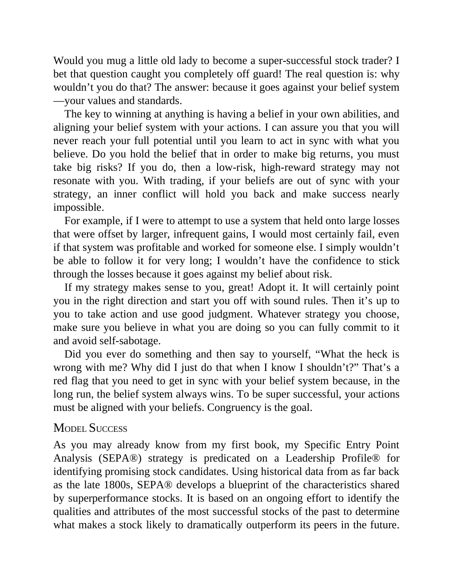

# Think and Trade Like a Champion - Page Image 11

## Source Page

Book: [[Think and Trade Like a Champion]]

## Page Read

Tags: risk-first, text-or-context-page

Concepts: [[Risk First]]

This page is mainly text/context. It is included so the image index has complete source coverage, but it should not be treated as an independent chart pattern.

## Linked Stock Figures

- No extracted stock-figure case on this page.

## Extracted Page Text Signal

Would you mug a little old lady to become a super-successful stock trader? I bet that question caught you completely off guard! The real question is: why wouldn’t you do that? The answer: because it goes against your belief system -your values and standards. The key to winning at anything is having a belief in your own abilities, and aligning your belief system with your actions. I can assure you that you will never reach your full potential until you learn to act in sync with what you believe. ...

## Manual Study Prompt

- What visual structure is the page trying to make obvious?
- Is the lesson about buying, avoiding, selling, or managing risk?
- If a ticker is not present, what generic behavior does the image teach?
- If a ticker is present, does the linked OHLCV rebuild confirm the same behavior?
