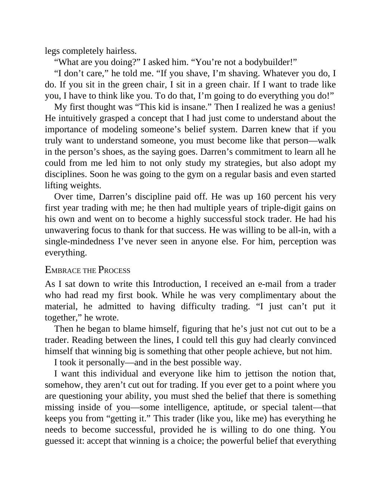

# Think and Trade Like a Champion - Page Image 13

## Source Page

Book: [[Think and Trade Like a Champion]]

## Page Read

Tags: mental-discipline, text-or-context-page

Concepts: [[Mental Discipline]]

This page is mainly text/context. It is included so the image index has complete source coverage, but it should not be treated as an independent chart pattern.

## Linked Stock Figures

- No extracted stock-figure case on this page.

## Extracted Page Text Signal

legs completely hairless. “What are you doing?” I asked him. “You’re not a bodybuilder!” “I don’t care,” he told me. “If you shave, I’m shaving. Whatever you do, I do. If you sit in the green chair, I sit in a green chair. If I want to trade like you, I have to think like you. To do that, I’m going to do everything you do!” My first thought was “This kid is insane.” Then I realized he was a genius! He intuitively grasped a concept that I had just come to understand about the importance of modeli...

## Manual Study Prompt

- What visual structure is the page trying to make obvious?
- Is the lesson about buying, avoiding, selling, or managing risk?
- If a ticker is not present, what generic behavior does the image teach?
- If a ticker is present, does the linked OHLCV rebuild confirm the same behavior?
