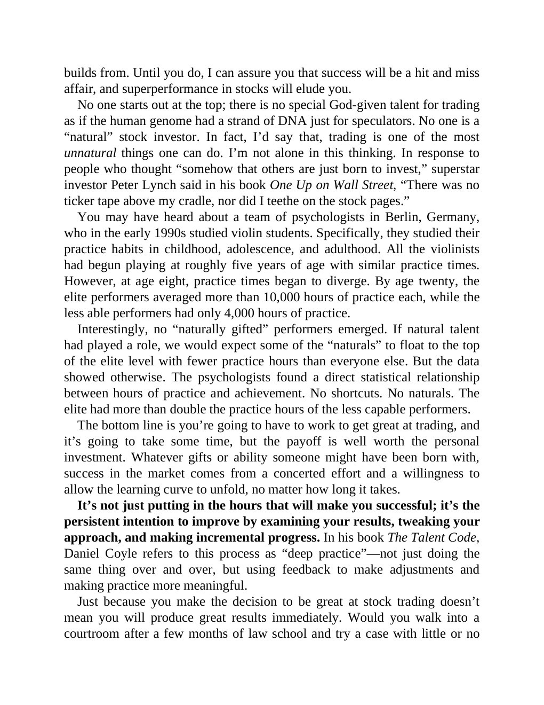

# Think and Trade Like a Champion - Page Image 14

## Source Page

Book: [[Think and Trade Like a Champion]]

## Page Read

Tags: text-or-context-page

Concepts: [[Mental Discipline]]

This page is mainly text/context. It is included so the image index has complete source coverage, but it should not be treated as an independent chart pattern.

## Linked Stock Figures

- No extracted stock-figure case on this page.

## Extracted Page Text Signal

builds from. Until you do, I can assure you that success will be a hit and miss affair, and superperformance in stocks will elude you. No one starts out at the top; there is no special God-given talent for trading as if the human genome had a strand of DNA just for speculators. No one is a “natural” stock investor. In fact, I’d say that, trading is one of the most unnatural things one can do. I’m not alone in this thinking. In response to people who thought “somehow that others are just born to ...

## Manual Study Prompt

- What visual structure is the page trying to make obvious?
- Is the lesson about buying, avoiding, selling, or managing risk?
- If a ticker is not present, what generic behavior does the image teach?
- If a ticker is present, does the linked OHLCV rebuild confirm the same behavior?
