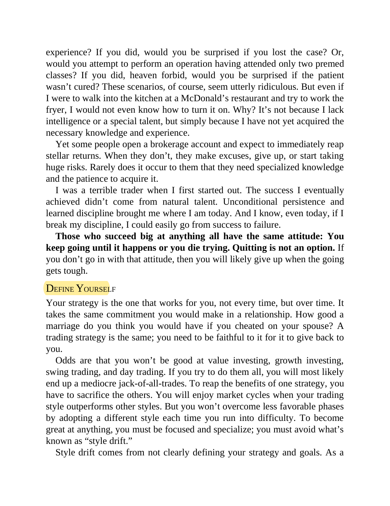

# Think and Trade Like a Champion - Page Image 15

## Source Page

Book: [[Think and Trade Like a Champion]]

## Page Read

Tags: mental-discipline, risk-first, sell-or-failure, text-or-context-page

Concepts: [[Mental Discipline]], [[Risk First]], [[Sell Rules and Failure Signals]]

This page is mainly text/context. It is included so the image index has complete source coverage, but it should not be treated as an independent chart pattern.

## Linked Stock Figures

- No extracted stock-figure case on this page.

## Extracted Page Text Signal

experience? If you did, would you be surprised if you lost the case? Or, would you attempt to perform an operation having attended only two premed classes? If you did, heaven forbid, would you be surprised if the patient wasn’t cured? These scenarios, of course, seem utterly ridiculous. But even if I were to walk into the kitchen at a McDonald’s restaurant and try to work the fryer, I would not even know how to turn it on. Why? It’s not because I lack intelligence or a special talent, but simply...

## Manual Study Prompt

- What visual structure is the page trying to make obvious?
- Is the lesson about buying, avoiding, selling, or managing risk?
- If a ticker is not present, what generic behavior does the image teach?
- If a ticker is present, does the linked OHLCV rebuild confirm the same behavior?
