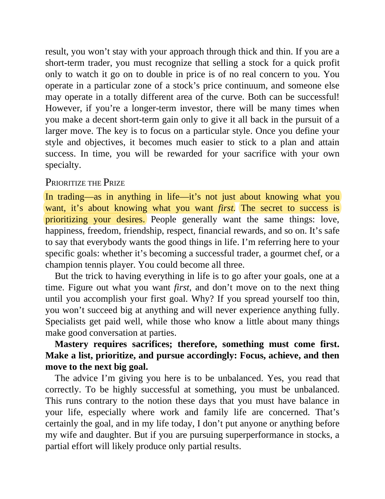

# Think and Trade Like a Champion - Page Image 16

## Source Page

Book: [[Think and Trade Like a Champion]]

## Page Read

Tags: manual-figure-page, sell-or-failure

Concepts: [[Mental Discipline]], [[Sell Rules and Failure Signals]]

This page contains figure language, but the ticker/date was not extractable from the caption text. Treat it as a manual visual case: identify the shape, decide whether it is a buy setup or an avoid/sell lesson, and only promote it to a trade template after a ticker/date can be reconciled.

## Linked Stock Figures

- No extracted stock-figure case on this page.

## Extracted Page Text Signal

result, you won’t stay with your approach through thick and thin. If you are a short-term trader, you must recognize that selling a stock for a quick profit only to watch it go on to double in price is of no real concern to you. You operate in a particular zone of a stock’s price continuum, and someone else may operate in a totally different area of the curve. Both can be successful! However, if you’re a longer-term investor, there will be many times when you make a decent short-term gain only t...

## Manual Study Prompt

- What visual structure is the page trying to make obvious?
- Is the lesson about buying, avoiding, selling, or managing risk?
- If a ticker is not present, what generic behavior does the image teach?
- If a ticker is present, does the linked OHLCV rebuild confirm the same behavior?
