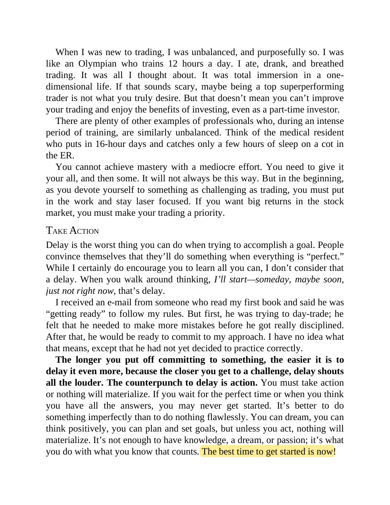

# Think and Trade Like a Champion - Page Image 17

## Source Page

Book: [[Think and Trade Like a Champion]]

## Page Read

Tags: mental-discipline, text-or-context-page

Concepts: [[Mental Discipline]]

This page is mainly text/context. It is included so the image index has complete source coverage, but it should not be treated as an independent chart pattern.

## Linked Stock Figures

- No extracted stock-figure case on this page.

## Extracted Page Text Signal

When I was new to trading, I was unbalanced, and purposefully so. I was like an Olympian who trains 12 hours a day. I ate, drank, and breathed trading. It was all I thought about. It was total immersion in a one- dimensional life. If that sounds scary, maybe being a top superperforming trader is not what you truly desire. But that doesn’t mean you can’t improve your trading and enjoy the benefits of investing, even as a part-time investor. There are plenty of other examples of professionals who,...

## Manual Study Prompt

- What visual structure is the page trying to make obvious?
- Is the lesson about buying, avoiding, selling, or managing risk?
- If a ticker is not present, what generic behavior does the image teach?
- If a ticker is present, does the linked OHLCV rebuild confirm the same behavior?
