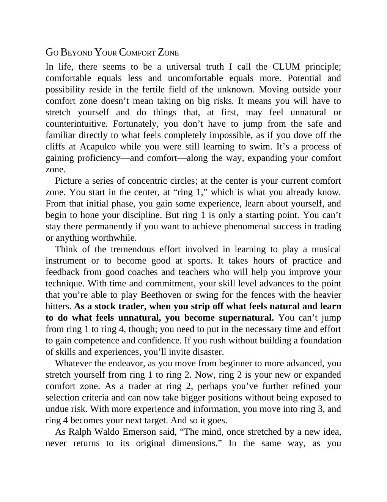

# Think and Trade Like a Champion - Page Image 18

## Source Page

Book: [[Think and Trade Like a Champion]]

## Page Read

Tags: mental-discipline, risk-first, text-or-context-page

Concepts: [[Mental Discipline]], [[Risk First]]

This page is mainly text/context. It is included so the image index has complete source coverage, but it should not be treated as an independent chart pattern.

## Linked Stock Figures

- No extracted stock-figure case on this page.

## Extracted Page Text Signal

GO BEYOND YOUR COMFORT ZONE In life, there seems to be a universal truth I call the CLUM principle; comfortable equals less and uncomfortable equals more. Potential and possibility reside in the fertile field of the unknown. Moving outside your comfort zone doesn’t mean taking on big risks. It means you will have to stretch yourself and do things that, at first, may feel unnatural or counterintuitive. Fortunately, you don’t have to jump from the safe and familiar directly to what feels completel...

## Manual Study Prompt

- What visual structure is the page trying to make obvious?
- Is the lesson about buying, avoiding, selling, or managing risk?
- If a ticker is not present, what generic behavior does the image teach?
- If a ticker is present, does the linked OHLCV rebuild confirm the same behavior?
