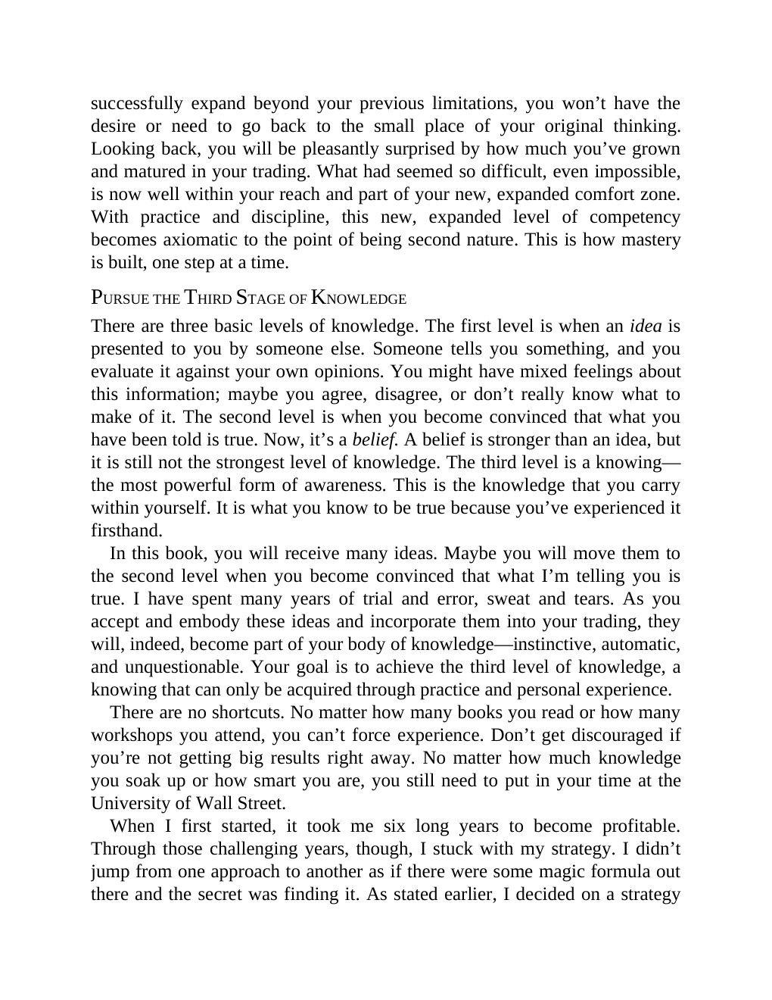

# Think and Trade Like a Champion - Page Image 19

## Source Page

Book: [[Think and Trade Like a Champion]]

## Page Read

Tags: mental-discipline, text-or-context-page

Concepts: [[Mental Discipline]]

This page is mainly text/context. It is included so the image index has complete source coverage, but it should not be treated as an independent chart pattern.

## Linked Stock Figures

- No extracted stock-figure case on this page.

## Extracted Page Text Signal

successfully expand beyond your previous limitations, you won’t have the desire or need to go back to the small place of your original thinking. Looking back, you will be pleasantly surprised by how much you’ve grown and matured in your trading. What had seemed so difficult, even impossible, is now well within your reach and part of your new, expanded comfort zone. With practice and discipline, this new, expanded level of competency becomes axiomatic to the point of being second nature. This is ...

## Manual Study Prompt

- What visual structure is the page trying to make obvious?
- Is the lesson about buying, avoiding, selling, or managing risk?
- If a ticker is not present, what generic behavior does the image teach?
- If a ticker is present, does the linked OHLCV rebuild confirm the same behavior?
