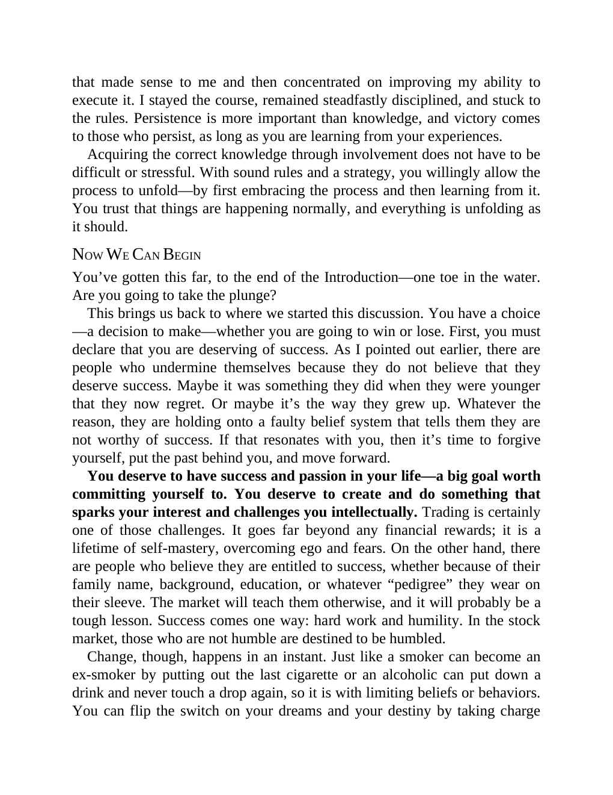

# Think and Trade Like a Champion - Page Image 20

## Source Page

Book: [[Think and Trade Like a Champion]]

## Page Read

Tags: mental-discipline, text-or-context-page

Concepts: [[Mental Discipline]]

This page is mainly text/context. It is included so the image index has complete source coverage, but it should not be treated as an independent chart pattern.

## Linked Stock Figures

- No extracted stock-figure case on this page.

## Extracted Page Text Signal

that made sense to me and then concentrated on improving my ability to execute it. I stayed the course, remained steadfastly disciplined, and stuck to the rules. Persistence is more important than knowledge, and victory comes to those who persist, as long as you are learning from your experiences. Acquiring the correct knowledge through involvement does not have to be difficult or stressful. With sound rules and a strategy, you willingly allow the process to unfold-by first embracing the process...

## Manual Study Prompt

- What visual structure is the page trying to make obvious?
- Is the lesson about buying, avoiding, selling, or managing risk?
- If a ticker is not present, what generic behavior does the image teach?
- If a ticker is present, does the linked OHLCV rebuild confirm the same behavior?
