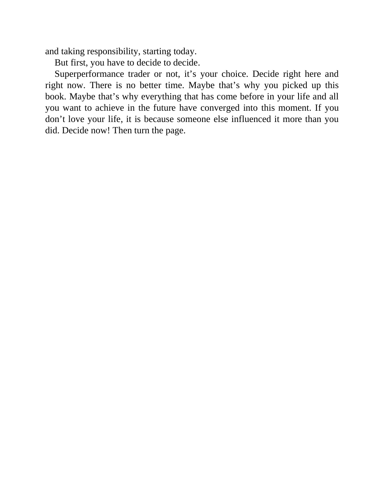

# Think and Trade Like a Champion - Page Image 21

## Source Page

Book: [[Think and Trade Like a Champion]]

## Page Read

Tags: text-or-context-page

Concepts: [[Mental Discipline]]

This page is mainly text/context. It is included so the image index has complete source coverage, but it should not be treated as an independent chart pattern.

## Linked Stock Figures

- No extracted stock-figure case on this page.

## Extracted Page Text Signal

and taking responsibility, starting today. But first, you have to decide to decide. Superperformance trader or not, it’s your choice. Decide right here and right now. There is no better time. Maybe that’s why you picked up this book. Maybe that’s why everything that has come before in your life and all you want to achieve in the future have converged into this moment. If you don’t love your life, it is because someone else influenced it more than you did. Decide now! Then turn the page

## Manual Study Prompt

- What visual structure is the page trying to make obvious?
- Is the lesson about buying, avoiding, selling, or managing risk?
- If a ticker is not present, what generic behavior does the image teach?
- If a ticker is present, does the linked OHLCV rebuild confirm the same behavior?
