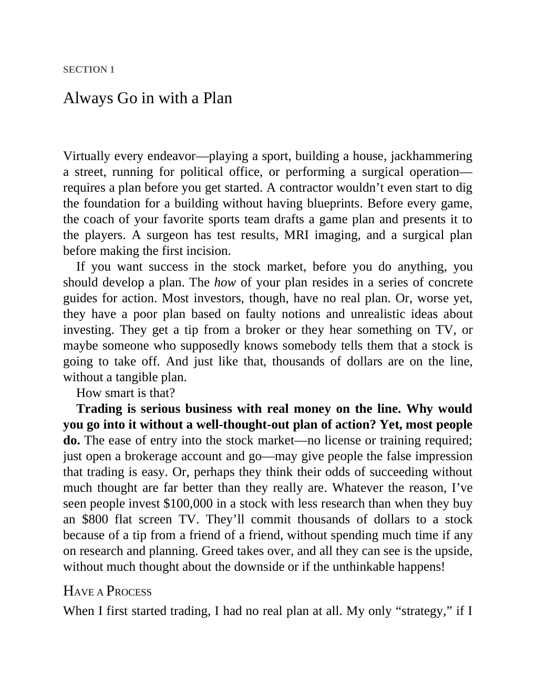

# Think and Trade Like a Champion - Page Image 22

## Source Page

Book: [[Think and Trade Like a Champion]]

## Page Read

Tags: text-or-context-page

Concepts: [[Mental Discipline]]

This page is mainly text/context. It is included so the image index has complete source coverage, but it should not be treated as an independent chart pattern.

## Linked Stock Figures

- No extracted stock-figure case on this page.

## Extracted Page Text Signal

SECTION 1 Always Go in with a Plan Virtually every endeavor-playing a sport, building a house, jackhammering a street, running for political office, or performing a surgical operation- requires a plan before you get started. A contractor wouldn’t even start to dig the foundation for a building without having blueprints. Before every game, the coach of your favorite sports team drafts a game plan and presents it to the players. A surgeon has test results, MRI imaging, and a surgical plan before m...

## Manual Study Prompt

- What visual structure is the page trying to make obvious?
- Is the lesson about buying, avoiding, selling, or managing risk?
- If a ticker is not present, what generic behavior does the image teach?
- If a ticker is present, does the linked OHLCV rebuild confirm the same behavior?
