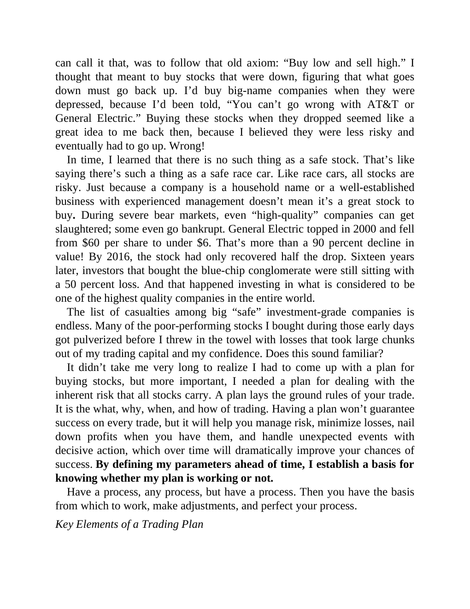

# Think and Trade Like a Champion - Page Image 23

## Source Page

Book: [[Think and Trade Like a Champion]]

## Page Read

Tags: risk-first, sell-or-failure, text-or-context-page

Concepts: [[Risk First]], [[Sell Rules and Failure Signals]]

This page is mainly text/context. It is included so the image index has complete source coverage, but it should not be treated as an independent chart pattern.

## Linked Stock Figures

- No extracted stock-figure case on this page.

## Extracted Page Text Signal

can call it that, was to follow that old axiom: “Buy low and sell high.” I thought that meant to buy stocks that were down, figuring that what goes down must go back up. I’d buy big-name companies when they were depressed, because I’d been told, “You can’t go wrong with AT&T or General Electric.” Buying these stocks when they dropped seemed like a great idea to me back then, because I believed they were less risky and eventually had to go up. Wrong! In time, I learned that there is no such thing...

## Manual Study Prompt

- What visual structure is the page trying to make obvious?
- Is the lesson about buying, avoiding, selling, or managing risk?
- If a ticker is not present, what generic behavior does the image teach?
- If a ticker is present, does the linked OHLCV rebuild confirm the same behavior?
