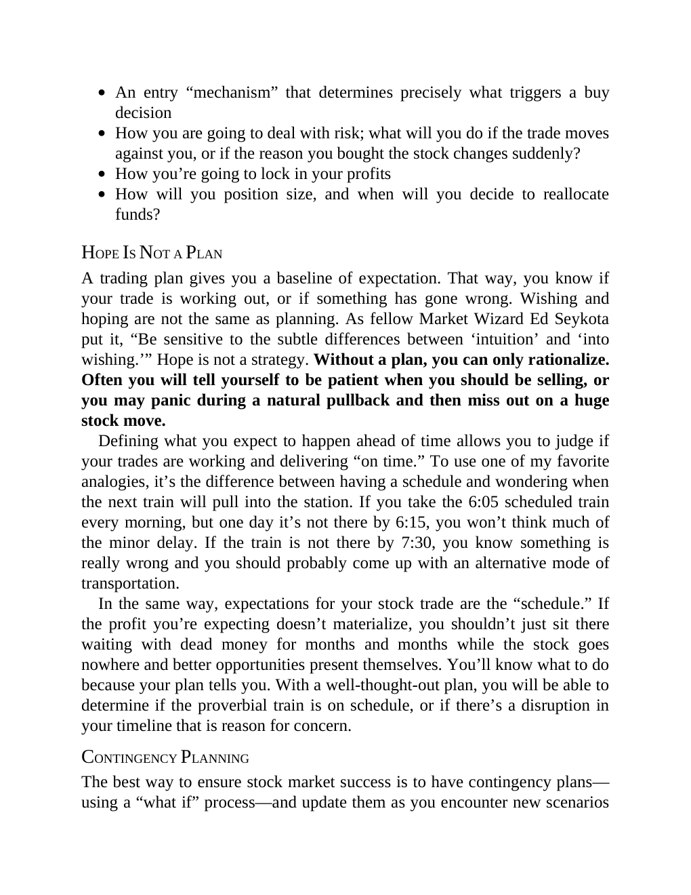

# Think and Trade Like a Champion - Page Image 24

## Source Page

Book: [[Think and Trade Like a Champion]]

## Page Read

Tags: risk-first, sell-or-failure, text-or-context-page

Concepts: [[Risk First]], [[Sell Rules and Failure Signals]]

This page is mainly text/context. It is included so the image index has complete source coverage, but it should not be treated as an independent chart pattern.

## Linked Stock Figures

- No extracted stock-figure case on this page.

## Extracted Page Text Signal

An entry “mechanism” that determines precisely what triggers a buy decision How you are going to deal with risk; what will you do if the trade moves against you, or if the reason you bought the stock changes suddenly? How you’re going to lock in your profits How will you position size, and when will you decide to reallocate funds? HOPE IS NOT A PLAN A trading plan gives you a baseline of expectation. That way, you know if your trade is working out, or if something has gone wrong. Wishing and hop...

## Manual Study Prompt

- What visual structure is the page trying to make obvious?
- Is the lesson about buying, avoiding, selling, or managing risk?
- If a ticker is not present, what generic behavior does the image teach?
- If a ticker is present, does the linked OHLCV rebuild confirm the same behavior?
