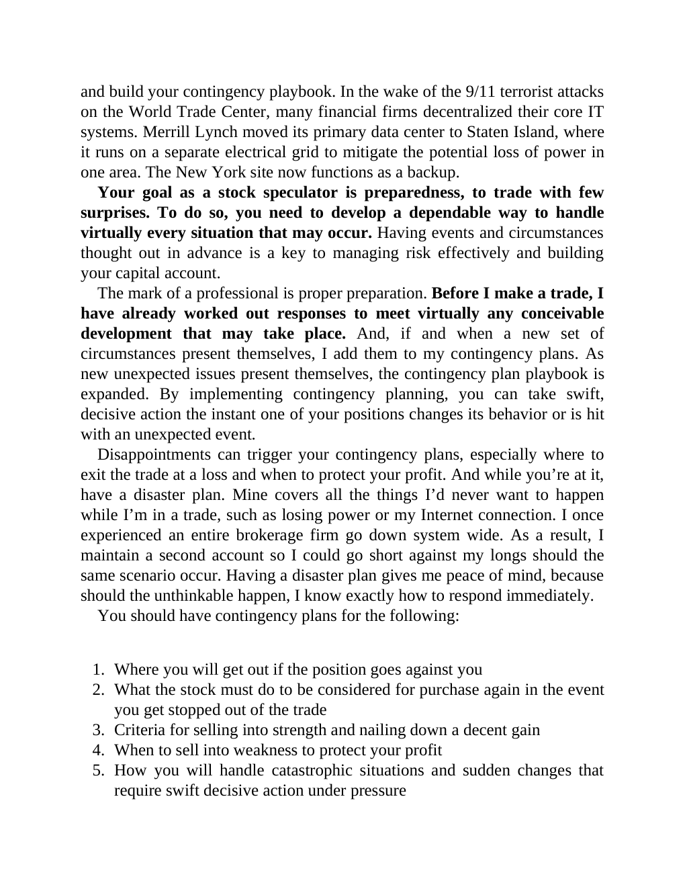

# Think and Trade Like a Champion - Page Image 25

## Source Page

Book: [[Think and Trade Like a Champion]]

## Page Read

Tags: risk-first, text-or-context-page

Concepts: [[Risk First]]

This page is mainly text/context. It is included so the image index has complete source coverage, but it should not be treated as an independent chart pattern.

## Linked Stock Figures

- No extracted stock-figure case on this page.

## Extracted Page Text Signal

and build your contingency playbook. In the wake of the 9/11 terrorist attacks on the World Trade Center, many financial firms decentralized their core IT systems. Merrill Lynch moved its primary data center to Staten Island, where it runs on a separate electrical grid to mitigate the potential loss of power in one area. The New York site now functions as a backup. Your goal as a stock speculator is preparedness, to trade with few surprises. To do so, you need to develop a dependable way to hand...

## Manual Study Prompt

- What visual structure is the page trying to make obvious?
- Is the lesson about buying, avoiding, selling, or managing risk?
- If a ticker is not present, what generic behavior does the image teach?
- If a ticker is present, does the linked OHLCV rebuild confirm the same behavior?
