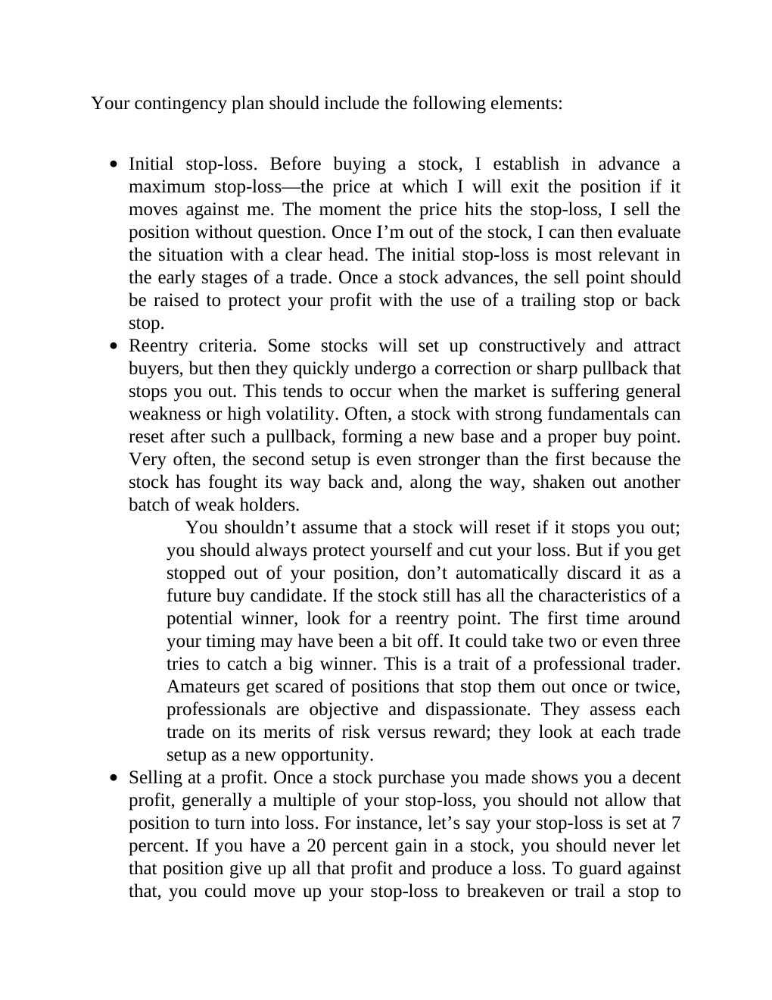

# Think and Trade Like a Champion - Page Image 26

## Source Page

Book: [[Think and Trade Like a Champion]]

## Page Read

Tags: risk-first, sell-or-failure, text-or-context-page

Concepts: [[Risk First]], [[Sell Rules and Failure Signals]]

This page is mainly text/context. It is included so the image index has complete source coverage, but it should not be treated as an independent chart pattern.

## Linked Stock Figures

- No extracted stock-figure case on this page.

## Extracted Page Text Signal

Your contingency plan should include the following elements: Initial stop-loss. Before buying a stock, I establish in advance a maximum stop-loss-the price at which I will exit the position if it moves against me. The moment the price hits the stop-loss, I sell the position without question. Once I’m out of the stock, I can then evaluate the situation with a clear head. The initial stop-loss is most relevant in the early stages of a trade. Once a stock advances, the sell point should be raised t...

## Manual Study Prompt

- What visual structure is the page trying to make obvious?
- Is the lesson about buying, avoiding, selling, or managing risk?
- If a ticker is not present, what generic behavior does the image teach?
- If a ticker is present, does the linked OHLCV rebuild confirm the same behavior?
