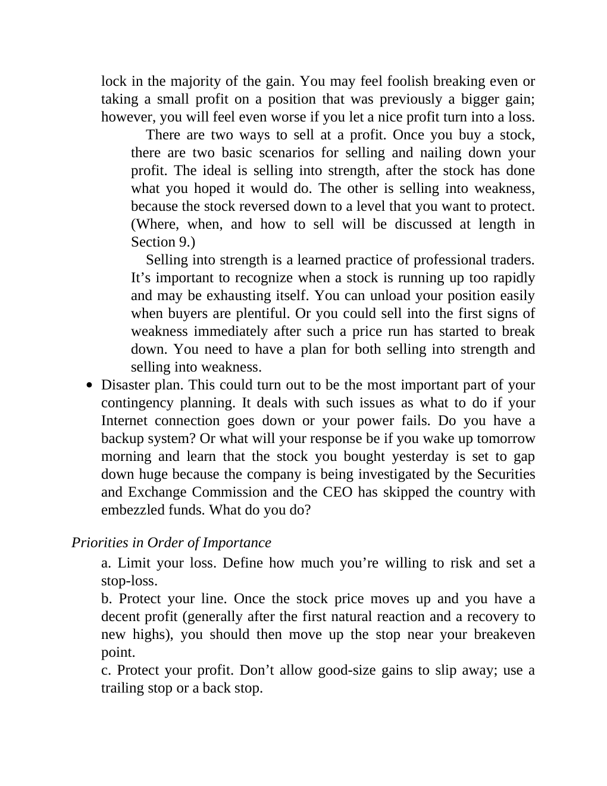

# Think and Trade Like a Champion - Page Image 27

## Source Page

Book: [[Think and Trade Like a Champion]]

## Page Read

Tags: sell-or-failure, text-or-context-page

Concepts: [[Sell Rules and Failure Signals]]

This page is mainly text/context. It is included so the image index has complete source coverage, but it should not be treated as an independent chart pattern.

## Linked Stock Figures

- No extracted stock-figure case on this page.

## Extracted Page Text Signal

lock in the majority of the gain. You may feel foolish breaking even or taking a small profit on a position that was previously a bigger gain; however, you will feel even worse if you let a nice profit turn into a loss. There are two ways to sell at a profit. Once you buy a stock, there are two basic scenarios for selling and nailing down your profit. The ideal is selling into strength, after the stock has done what you hoped it would do. The other is selling into weakness, because the stock rev...

## Manual Study Prompt

- What visual structure is the page trying to make obvious?
- Is the lesson about buying, avoiding, selling, or managing risk?
- If a ticker is not present, what generic behavior does the image teach?
- If a ticker is present, does the linked OHLCV rebuild confirm the same behavior?
