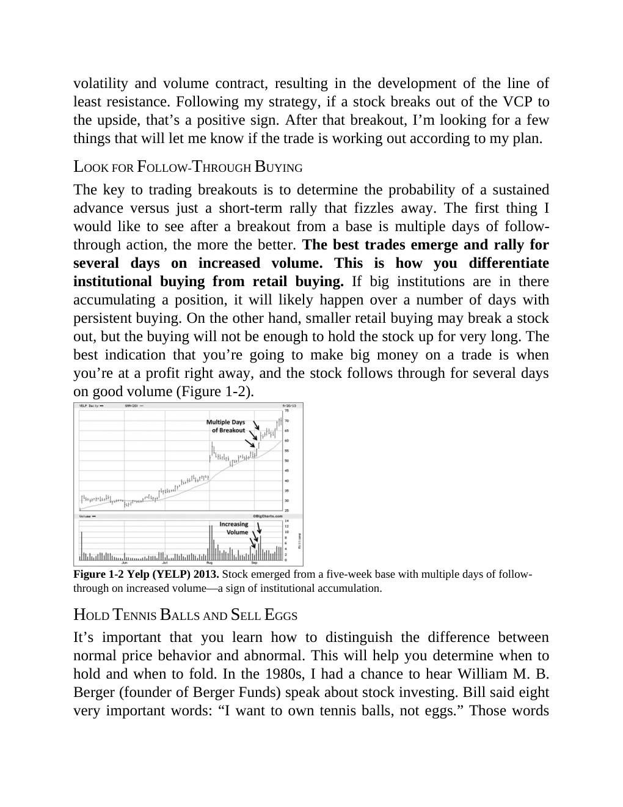

# Think and Trade Like a Champion - Page Image 29

## Source Page

Book: [[Think and Trade Like a Champion]]

## Page Read

Tags: pivot-breakout, pivot-or-entry, sell-or-failure, stage-2-leadership, stock-chart-page, vcp-or-tightening, volume-behavior

Concepts: [[Pivot and Entry]], [[Relative Strength Leadership]], [[Sell Rules and Failure Signals]], [[Stage 2 Uptrend]], [[Trend Template]], [[Volatility Contraction Pattern]], [[Volume Dry-Up and Accumulation]]

This page contains one or more stock-chart figures already reconciled in the stock-image layer. Study the source page first for the visual lesson, then open the linked case notes to compare it against rebuilt OHLCV data.

## Linked Stock Figures

- [[Think and Trade Like a Champion - Figure 1-2 - YELP - page 29]] - YELP - vcp-or-tightening; pivot-breakout; stage-2-leadership

## Extracted Page Text Signal

volatility and volume contract, resulting in the development of the line of least resistance. Following my strategy, if a stock breaks out of the VCP to the upside, that’s a positive sign. After that breakout, I’m looking for a few things that will let me know if the trade is working out according to my plan. LOOK FOR FOLLOW-THROUGH BUYING The key to trading breakouts is to determine the probability of a sustained advance versus just a short-term rally that fizzles away. The first thing I would ...

## Manual Study Prompt

- What visual structure is the page trying to make obvious?
- Is the lesson about buying, avoiding, selling, or managing risk?
- If a ticker is not present, what generic behavior does the image teach?
- If a ticker is present, does the linked OHLCV rebuild confirm the same behavior?
