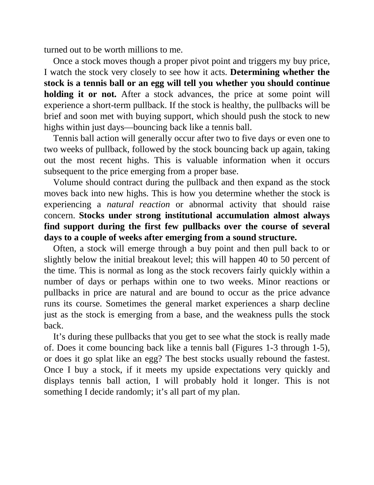

# Think and Trade Like a Champion - Page Image 30

## Source Page

Book: [[Think and Trade Like a Champion]]

## Page Read

Tags: pivot-or-entry, text-or-context-page, volume-behavior

Concepts: [[Pivot and Entry]], [[Volume Dry-Up and Accumulation]]

This page is mainly text/context. It is included so the image index has complete source coverage, but it should not be treated as an independent chart pattern.

## Linked Stock Figures

- No extracted stock-figure case on this page.

## Extracted Page Text Signal

turned out to be worth millions to me. Once a stock moves though a proper pivot point and triggers my buy price, I watch the stock very closely to see how it acts. Determining whether the stock is a tennis ball or an egg will tell you whether you should continue holding it or not. After a stock advances, the price at some point will experience a short-term pullback. If the stock is healthy, the pullbacks will be brief and soon met with buying support, which should push the stock to new highs wit...

## Manual Study Prompt

- What visual structure is the page trying to make obvious?
- Is the lesson about buying, avoiding, selling, or managing risk?
- If a ticker is not present, what generic behavior does the image teach?
- If a ticker is present, does the linked OHLCV rebuild confirm the same behavior?
