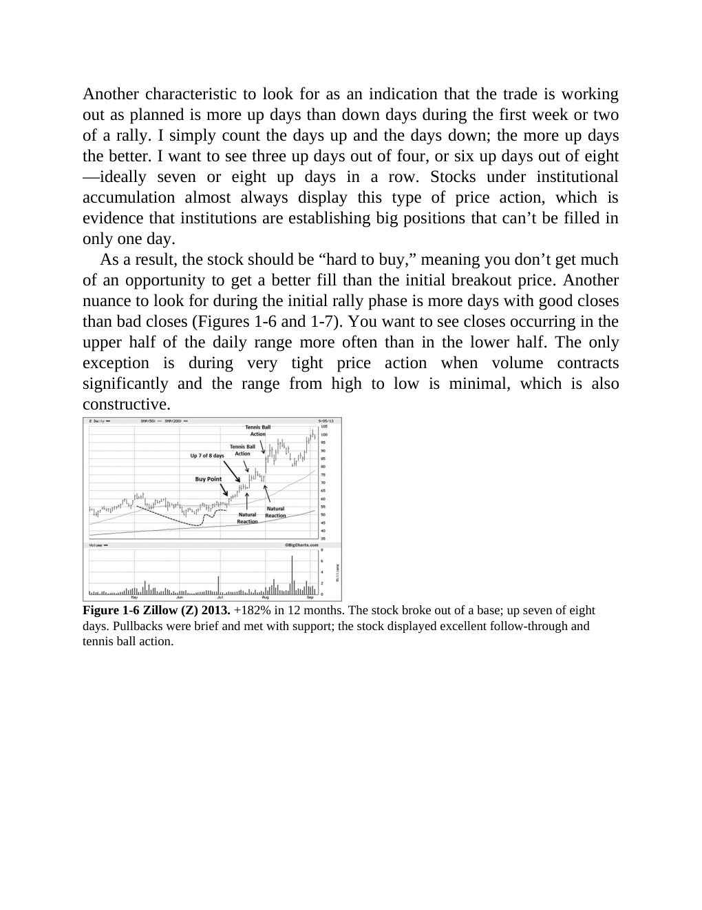

# Think and Trade Like a Champion - Page Image 32

## Source Page

Book: [[Think and Trade Like a Champion]]

## Page Read

Tags: manual-review-needed, pivot-or-entry, stock-chart-page, volume-behavior

Concepts: [[Mental Discipline]], [[Pivot and Entry]], [[Volume Dry-Up and Accumulation]]

This page contains one or more stock-chart figures already reconciled in the stock-image layer. Study the source page first for the visual lesson, then open the linked case notes to compare it against rebuilt OHLCV data.

## Linked Stock Figures

- [[Think and Trade Like a Champion - Figure 1-6 - manual-review - page 32]] - manual - manual-review-needed

## Extracted Page Text Signal

Another characteristic to look for as an indication that the trade is working out as planned is more up days than down days during the first week or two of a rally. I simply count the days up and the days down; the more up days the better. I want to see three up days out of four, or six up days out of eight -ideally seven or eight up days in a row. Stocks under institutional accumulation almost always display this type of price action, which is evidence that institutions are establishing big pos...

## Manual Study Prompt

- What visual structure is the page trying to make obvious?
- Is the lesson about buying, avoiding, selling, or managing risk?
- If a ticker is not present, what generic behavior does the image teach?
- If a ticker is present, does the linked OHLCV rebuild confirm the same behavior?
