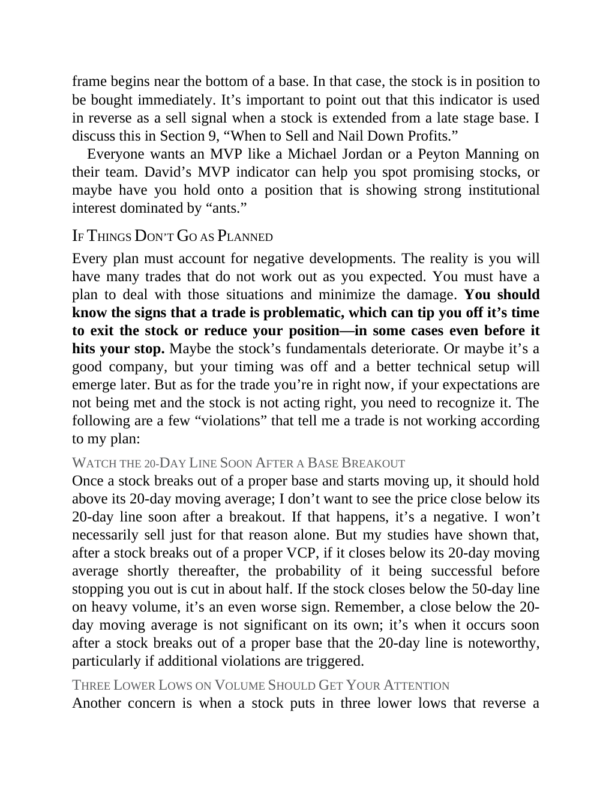

# Think and Trade Like a Champion - Page Image 35

## Source Page

Book: [[Think and Trade Like a Champion]]

## Page Read

Tags: pivot-or-entry, risk-first, sell-or-failure, text-or-context-page

Concepts: [[Pivot and Entry]], [[Risk First]], [[Sell Rules and Failure Signals]]

This page is mainly text/context. It is included so the image index has complete source coverage, but it should not be treated as an independent chart pattern.

## Linked Stock Figures

- No extracted stock-figure case on this page.

## Extracted Page Text Signal

frame begins near the bottom of a base. In that case, the stock is in position to be bought immediately. It’s important to point out that this indicator is used in reverse as a sell signal when a stock is extended from a late stage base. I discuss this in Section 9, “When to Sell and Nail Down Profits.” Everyone wants an MVP like a Michael Jordan or a Peyton Manning on their team. David’s MVP indicator can help you spot promising stocks, or maybe have you hold onto a position that is showing str...

## Manual Study Prompt

- What visual structure is the page trying to make obvious?
- Is the lesson about buying, avoiding, selling, or managing risk?
- If a ticker is not present, what generic behavior does the image teach?
- If a ticker is present, does the linked OHLCV rebuild confirm the same behavior?
