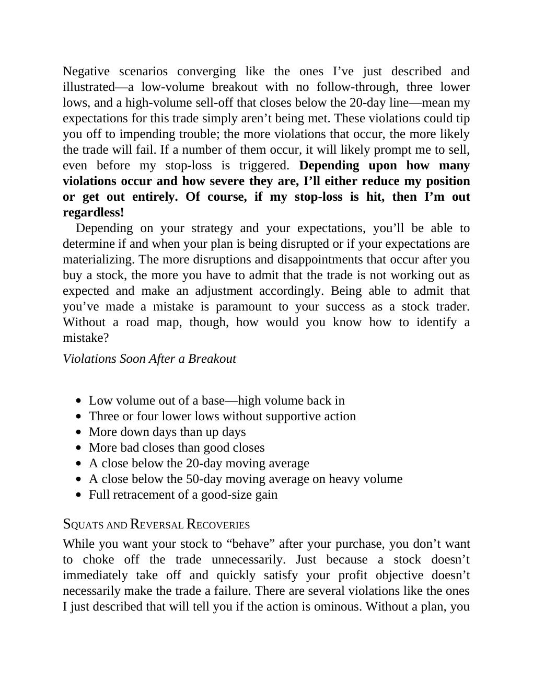

# Think and Trade Like a Champion - Page Image 38

## Source Page

Book: [[Think and Trade Like a Champion]]

## Page Read

Tags: mental-discipline, pivot-or-entry, risk-first, sell-or-failure, text-or-context-page, volume-behavior

Concepts: [[Mental Discipline]], [[Pivot and Entry]], [[Risk First]], [[Sell Rules and Failure Signals]], [[Volume Dry-Up and Accumulation]]

This page is mainly text/context. It is included so the image index has complete source coverage, but it should not be treated as an independent chart pattern.

## Linked Stock Figures

- No extracted stock-figure case on this page.

## Extracted Page Text Signal

Negative scenarios converging like the ones I’ve just described and illustrated-a low-volume breakout with no follow-through, three lower lows, and a high-volume sell-off that closes below the 20-day line-mean my expectations for this trade simply aren’t being met. These violations could tip you off to impending trouble; the more violations that occur, the more likely the trade will fail. If a number of them occur, it will likely prompt me to sell, even before my stop-loss is triggered. Dependin...

## Manual Study Prompt

- What visual structure is the page trying to make obvious?
- Is the lesson about buying, avoiding, selling, or managing risk?
- If a ticker is not present, what generic behavior does the image teach?
- If a ticker is present, does the linked OHLCV rebuild confirm the same behavior?
