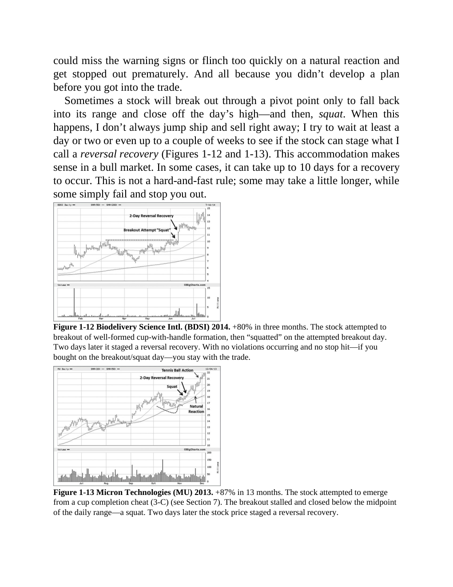

# Think and Trade Like a Champion - Page Image 39

## Source Page

Book: [[Think and Trade Like a Champion]]

## Page Read

Tags: cheat-entry, manual-review-needed, pivot-breakout, pivot-or-entry, risk-first, sell-or-failure, stage-2-leadership, stock-chart-page, vcp-or-tightening, volume-dry-up

Concepts: [[Mental Discipline]], [[Pivot and Entry]], [[Relative Strength Leadership]], [[Risk First]], [[Sell Rules and Failure Signals]], [[Stage 2 Uptrend]], [[Trend Template]], [[Volatility Contraction Pattern]], [[Volume Dry-Up and Accumulation]]

This page contains one or more stock-chart figures already reconciled in the stock-image layer. Study the source page first for the visual lesson, then open the linked case notes to compare it against rebuilt OHLCV data.

## Linked Stock Figures

- [[Think and Trade Like a Champion - Figure 1-12 - BDSI - page 39]] - BDSI - manual-review-needed
- [[Think and Trade Like a Champion - Figure 1-13 - MU - page 39]] - MU - vcp-or-tightening; pivot-breakout; cheat-entry; volume-dry-up; stage-2-leadership

## Extracted Page Text Signal

could miss the warning signs or flinch too quickly on a natural reaction and get stopped out prematurely. And all because you didn’t develop a plan before you got into the trade. Sometimes a stock will break out through a pivot point only to fall back into its range and close off the day’s high-and then, squat. When this happens, I don’t always jump ship and sell right away; I try to wait at least a day or two or even up to a couple of weeks to see if the stock can stage what I call a reversal r...

## Manual Study Prompt

- What visual structure is the page trying to make obvious?
- Is the lesson about buying, avoiding, selling, or managing risk?
- If a ticker is not present, what generic behavior does the image teach?
- If a ticker is present, does the linked OHLCV rebuild confirm the same behavior?
