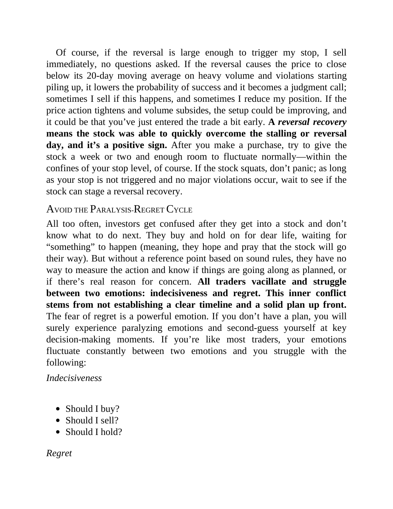

# Think and Trade Like a Champion - Page Image 40

## Source Page

Book: [[Think and Trade Like a Champion]]

## Page Read

Tags: risk-first, sell-or-failure, text-or-context-page, volume-behavior

Concepts: [[Risk First]], [[Sell Rules and Failure Signals]], [[Volume Dry-Up and Accumulation]]

This page is mainly text/context. It is included so the image index has complete source coverage, but it should not be treated as an independent chart pattern.

## Linked Stock Figures

- No extracted stock-figure case on this page.

## Extracted Page Text Signal

Of course, if the reversal is large enough to trigger my stop, I sell immediately, no questions asked. If the reversal causes the price to close below its 20-day moving average on heavy volume and violations starting piling up, it lowers the probability of success and it becomes a judgment call; sometimes I sell if this happens, and sometimes I reduce my position. If the price action tightens and volume subsides, the setup could be improving, and it could be that you’ve just entered the trade a ...

## Manual Study Prompt

- What visual structure is the page trying to make obvious?
- Is the lesson about buying, avoiding, selling, or managing risk?
- If a ticker is not present, what generic behavior does the image teach?
- If a ticker is present, does the linked OHLCV rebuild confirm the same behavior?
