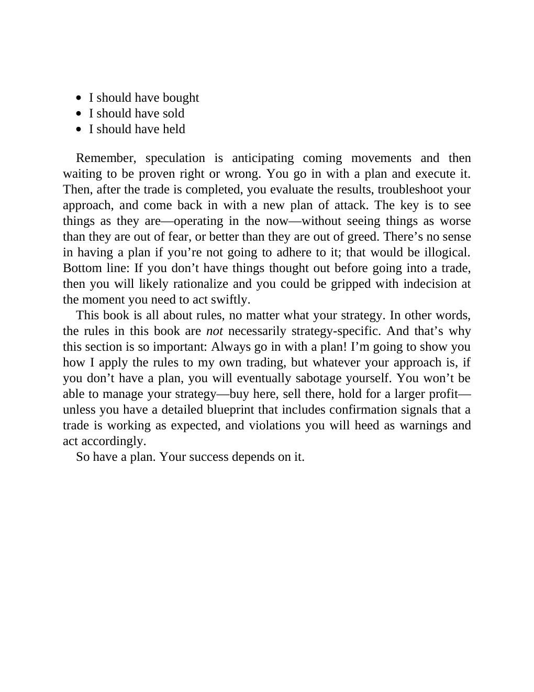

# Think and Trade Like a Champion - Page Image 41

## Source Page

Book: [[Think and Trade Like a Champion]]

## Page Read

Tags: sell-or-failure, text-or-context-page

Concepts: [[Sell Rules and Failure Signals]]

This page is mainly text/context. It is included so the image index has complete source coverage, but it should not be treated as an independent chart pattern.

## Linked Stock Figures

- No extracted stock-figure case on this page.

## Extracted Page Text Signal

I should have bought I should have sold I should have held Remember, speculation is anticipating coming movements and then waiting to be proven right or wrong. You go in with a plan and execute it. Then, after the trade is completed, you evaluate the results, troubleshoot your approach, and come back in with a new plan of attack. The key is to see things as they are-operating in the now-without seeing things as worse than they are out of fear, or better than they are out of greed. There’s no sen...

## Manual Study Prompt

- What visual structure is the page trying to make obvious?
- Is the lesson about buying, avoiding, selling, or managing risk?
- If a ticker is not present, what generic behavior does the image teach?
- If a ticker is present, does the linked OHLCV rebuild confirm the same behavior?
