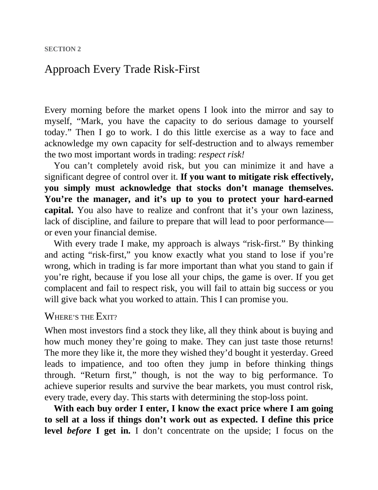

# Think and Trade Like a Champion - Page Image 42

## Source Page

Book: [[Think and Trade Like a Champion]]

## Page Read

Tags: mental-discipline, risk-first, sell-or-failure, text-or-context-page

Concepts: [[Mental Discipline]], [[Risk First]], [[Sell Rules and Failure Signals]]

This page is mainly text/context. It is included so the image index has complete source coverage, but it should not be treated as an independent chart pattern.

## Linked Stock Figures

- No extracted stock-figure case on this page.

## Extracted Page Text Signal

SECTION 2 Approach Every Trade Risk-First Every morning before the market opens I look into the mirror and say to myself, “Mark, you have the capacity to do serious damage to yourself today.” Then I go to work. I do this little exercise as a way to face and acknowledge my own capacity for self-destruction and to always remember the two most important words in trading: respect risk! You can’t completely avoid risk, but you can minimize it and have a significant degree of control over it. If you w...

## Manual Study Prompt

- What visual structure is the page trying to make obvious?
- Is the lesson about buying, avoiding, selling, or managing risk?
- If a ticker is not present, what generic behavior does the image teach?
- If a ticker is present, does the linked OHLCV rebuild confirm the same behavior?
