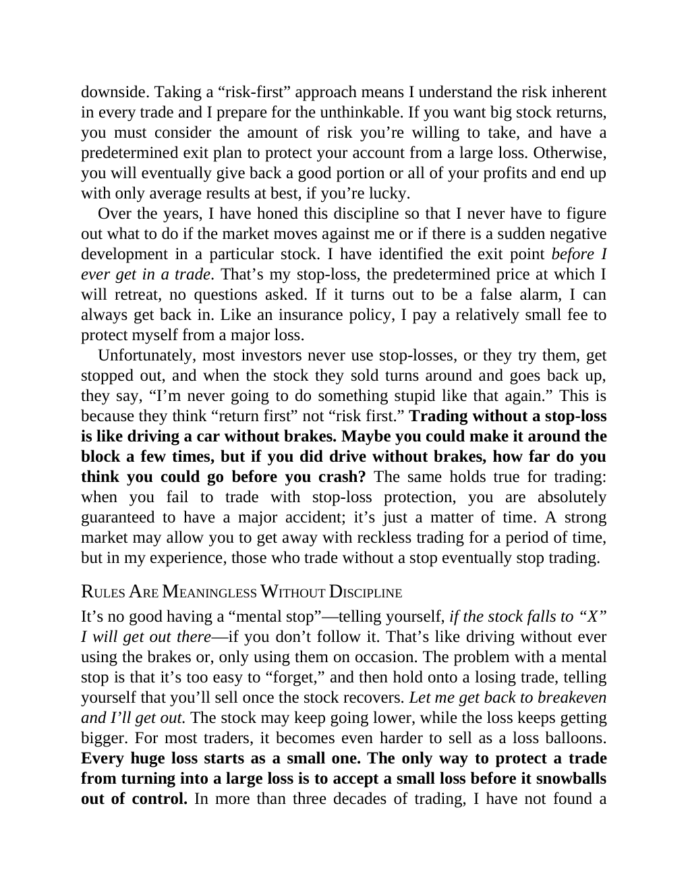

# Think and Trade Like a Champion - Page Image 43

## Source Page

Book: [[Think and Trade Like a Champion]]

## Page Read

Tags: manual-figure-page, mental-discipline, risk-first

Concepts: [[Mental Discipline]], [[Risk First]]

This page contains figure language, but the ticker/date was not extractable from the caption text. Treat it as a manual visual case: identify the shape, decide whether it is a buy setup or an avoid/sell lesson, and only promote it to a trade template after a ticker/date can be reconciled.

## Linked Stock Figures

- No extracted stock-figure case on this page.

## Extracted Page Text Signal

downside. Taking a “risk-first” approach means I understand the risk inherent in every trade and I prepare for the unthinkable. If you want big stock returns, you must consider the amount of risk you’re willing to take, and have a predetermined exit plan to protect your account from a large loss. Otherwise, you will eventually give back a good portion or all of your profits and end up with only average results at best, if you’re lucky. Over the years, I have honed this discipline so that I never...

## Manual Study Prompt

- What visual structure is the page trying to make obvious?
- Is the lesson about buying, avoiding, selling, or managing risk?
- If a ticker is not present, what generic behavior does the image teach?
- If a ticker is present, does the linked OHLCV rebuild confirm the same behavior?
