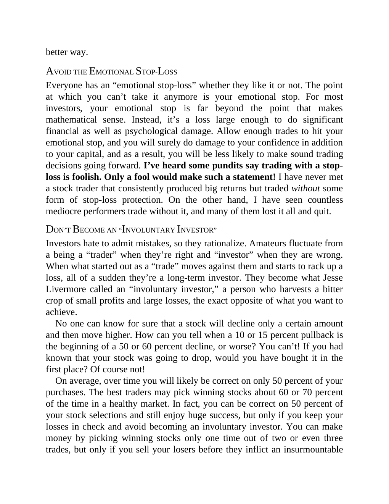

# Think and Trade Like a Champion - Page Image 44

## Source Page

Book: [[Think and Trade Like a Champion]]

## Page Read

Tags: mental-discipline, risk-first, text-or-context-page

Concepts: [[Mental Discipline]], [[Risk First]]

This page is mainly text/context. It is included so the image index has complete source coverage, but it should not be treated as an independent chart pattern.

## Linked Stock Figures

- No extracted stock-figure case on this page.

## Extracted Page Text Signal

better way. AVOID THE EMOTIONAL STOP-LOSS Everyone has an “emotional stop-loss” whether they like it or not. The point at which you can’t take it anymore is your emotional stop. For most investors, your emotional stop is far beyond the point that makes mathematical sense. Instead, it’s a loss large enough to do significant financial as well as psychological damage. Allow enough trades to hit your emotional stop, and you will surely do damage to your confidence in addition to your capital, and as...

## Manual Study Prompt

- What visual structure is the page trying to make obvious?
- Is the lesson about buying, avoiding, selling, or managing risk?
- If a ticker is not present, what generic behavior does the image teach?
- If a ticker is present, does the linked OHLCV rebuild confirm the same behavior?
