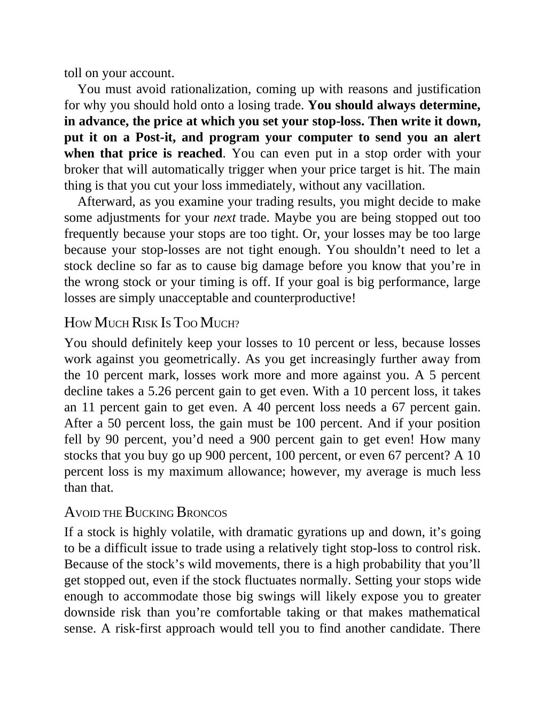

# Think and Trade Like a Champion - Page Image 45

## Source Page

Book: [[Think and Trade Like a Champion]]

## Page Read

Tags: risk-first, text-or-context-page

Concepts: [[Risk First]]

This page is mainly text/context. It is included so the image index has complete source coverage, but it should not be treated as an independent chart pattern.

## Linked Stock Figures

- No extracted stock-figure case on this page.

## Extracted Page Text Signal

toll on your account. You must avoid rationalization, coming up with reasons and justification for why you should hold onto a losing trade. You should always determine, in advance, the price at which you set your stop-loss. Then write it down, put it on a Post-it, and program your computer to send you an alert when that price is reached. You can even put in a stop order with your broker that will automatically trigger when your price target is hit. The main thing is that you cut your loss immedi...

## Manual Study Prompt

- What visual structure is the page trying to make obvious?
- Is the lesson about buying, avoiding, selling, or managing risk?
- If a ticker is not present, what generic behavior does the image teach?
- If a ticker is present, does the linked OHLCV rebuild confirm the same behavior?
