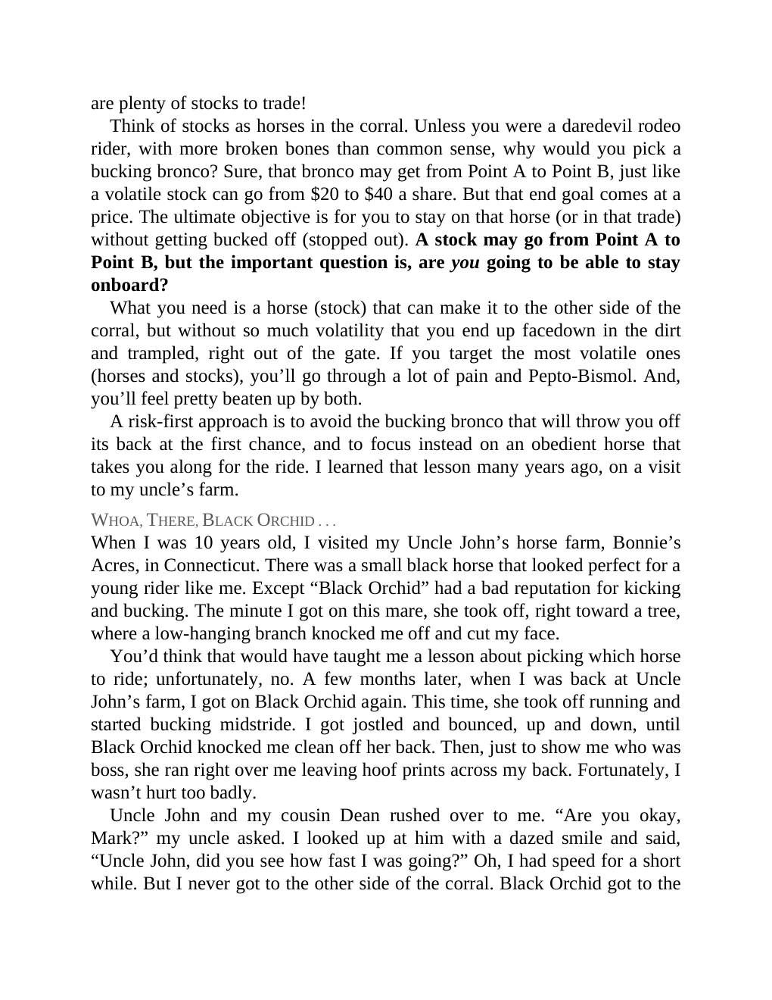

# Think and Trade Like a Champion - Page Image 46

## Source Page

Book: [[Think and Trade Like a Champion]]

## Page Read

Tags: risk-first, text-or-context-page

Concepts: [[Risk First]]

This page is mainly text/context. It is included so the image index has complete source coverage, but it should not be treated as an independent chart pattern.

## Linked Stock Figures

- No extracted stock-figure case on this page.

## Extracted Page Text Signal

are plenty of stocks to trade! Think of stocks as horses in the corral. Unless you were a daredevil rodeo rider, with more broken bones than common sense, why would you pick a bucking bronco? Sure, that bronco may get from Point A to Point B, just like a volatile stock can go from $20 to $40 a share. But that end goal comes at a price. The ultimate objective is for you to stay on that horse (or in that trade) without getting bucked off (stopped out). A stock may go from Point A to Point B, but t...

## Manual Study Prompt

- What visual structure is the page trying to make obvious?
- Is the lesson about buying, avoiding, selling, or managing risk?
- If a ticker is not present, what generic behavior does the image teach?
- If a ticker is present, does the linked OHLCV rebuild confirm the same behavior?
