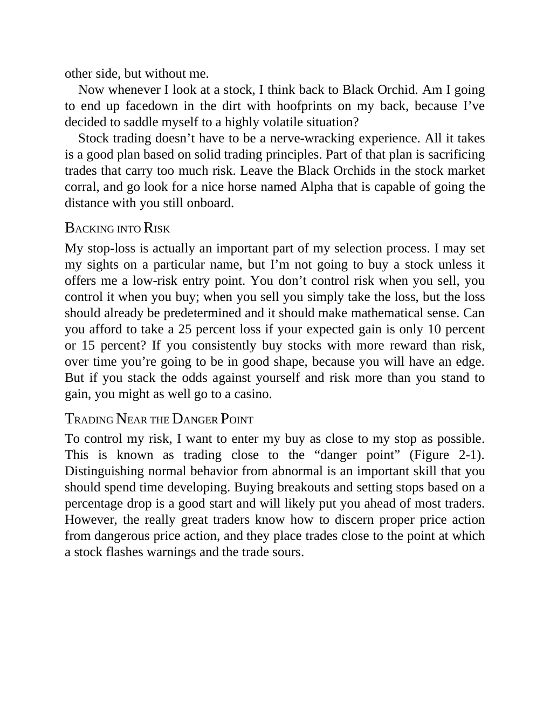

# Think and Trade Like a Champion - Page Image 47

## Source Page

Book: [[Think and Trade Like a Champion]]

## Page Read

Tags: manual-figure-page, risk-first, sell-or-failure

Concepts: [[Mental Discipline]], [[Risk First]], [[Sell Rules and Failure Signals]]

This page contains figure language, but the ticker/date was not extractable from the caption text. Treat it as a manual visual case: identify the shape, decide whether it is a buy setup or an avoid/sell lesson, and only promote it to a trade template after a ticker/date can be reconciled.

## Linked Stock Figures

- No extracted stock-figure case on this page.

## Extracted Page Text Signal

other side, but without me. Now whenever I look at a stock, I think back to Black Orchid. Am I going to end up facedown in the dirt with hoofprints on my back, because I’ve decided to saddle myself to a highly volatile situation? Stock trading doesn’t have to be a nerve-wracking experience. All it takes is a good plan based on solid trading principles. Part of that plan is sacrificing trades that carry too much risk. Leave the Black Orchids in the stock market corral, and go look for a nice hors...

## Manual Study Prompt

- What visual structure is the page trying to make obvious?
- Is the lesson about buying, avoiding, selling, or managing risk?
- If a ticker is not present, what generic behavior does the image teach?
- If a ticker is present, does the linked OHLCV rebuild confirm the same behavior?
