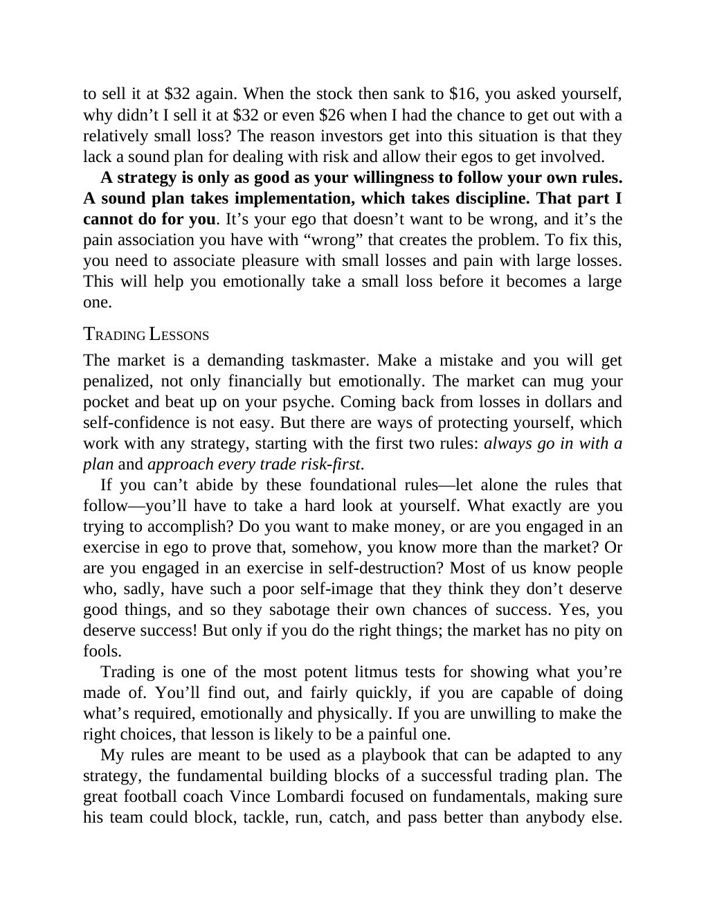

# Think and Trade Like a Champion - Page Image 50

## Source Page

Book: [[Think and Trade Like a Champion]]

## Page Read

Tags: mental-discipline, risk-first, sell-or-failure, text-or-context-page

Concepts: [[Mental Discipline]], [[Risk First]], [[Sell Rules and Failure Signals]]

This page is mainly text/context. It is included so the image index has complete source coverage, but it should not be treated as an independent chart pattern.

## Linked Stock Figures

- No extracted stock-figure case on this page.

## Extracted Page Text Signal

to sell it at $32 again. When the stock then sank to $16, you asked yourself, why didn’t I sell it at $32 or even $26 when I had the chance to get out with a relatively small loss? The reason investors get into this situation is that they lack a sound plan for dealing with risk and allow their egos to get involved. A strategy is only as good as your willingness to follow your own rules. A sound plan takes implementation, which takes discipline. That part I cannot do for you. It’s your ego that d...

## Manual Study Prompt

- What visual structure is the page trying to make obvious?
- Is the lesson about buying, avoiding, selling, or managing risk?
- If a ticker is not present, what generic behavior does the image teach?
- If a ticker is present, does the linked OHLCV rebuild confirm the same behavior?
