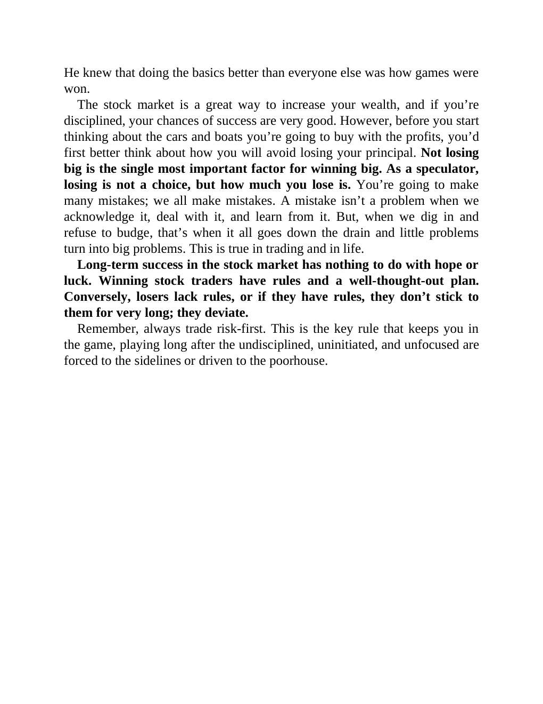

# Think and Trade Like a Champion - Page Image 51

## Source Page

Book: [[Think and Trade Like a Champion]]

## Page Read

Tags: mental-discipline, risk-first, text-or-context-page

Concepts: [[Mental Discipline]], [[Risk First]]

This page is mainly text/context. It is included so the image index has complete source coverage, but it should not be treated as an independent chart pattern.

## Linked Stock Figures

- No extracted stock-figure case on this page.

## Extracted Page Text Signal

He knew that doing the basics better than everyone else was how games were won. The stock market is a great way to increase your wealth, and if you’re disciplined, your chances of success are very good. However, before you start thinking about the cars and boats you’re going to buy with the profits, you’d first better think about how you will avoid losing your principal. Not losing big is the single most important factor for winning big. As a speculator, losing is not a choice, but how much you ...

## Manual Study Prompt

- What visual structure is the page trying to make obvious?
- Is the lesson about buying, avoiding, selling, or managing risk?
- If a ticker is not present, what generic behavior does the image teach?
- If a ticker is present, does the linked OHLCV rebuild confirm the same behavior?
