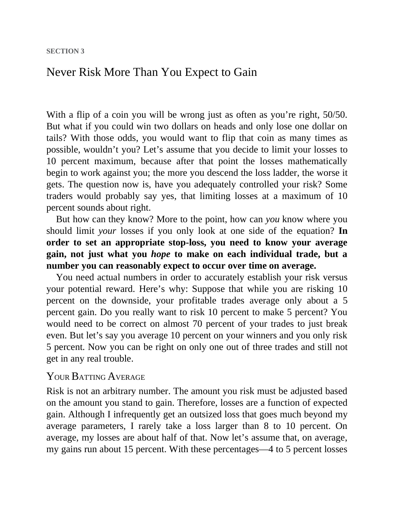

# Think and Trade Like a Champion - Page Image 52

## Source Page

Book: [[Think and Trade Like a Champion]]

## Page Read

Tags: risk-first, text-or-context-page

Concepts: [[Risk First]]

This page is mainly text/context. It is included so the image index has complete source coverage, but it should not be treated as an independent chart pattern.

## Linked Stock Figures

- No extracted stock-figure case on this page.

## Extracted Page Text Signal

SECTION 3 Never Risk More Than You Expect to Gain With a flip of a coin you will be wrong just as often as you’re right, 50/50. But what if you could win two dollars on heads and only lose one dollar on tails? With those odds, you would want to flip that coin as many times as possible, wouldn’t you? Let’s assume that you decide to limit your losses to 10 percent maximum, because after that point the losses mathematically begin to work against you; the more you descend the loss ladder, the worse ...

## Manual Study Prompt

- What visual structure is the page trying to make obvious?
- Is the lesson about buying, avoiding, selling, or managing risk?
- If a ticker is not present, what generic behavior does the image teach?
- If a ticker is present, does the linked OHLCV rebuild confirm the same behavior?
