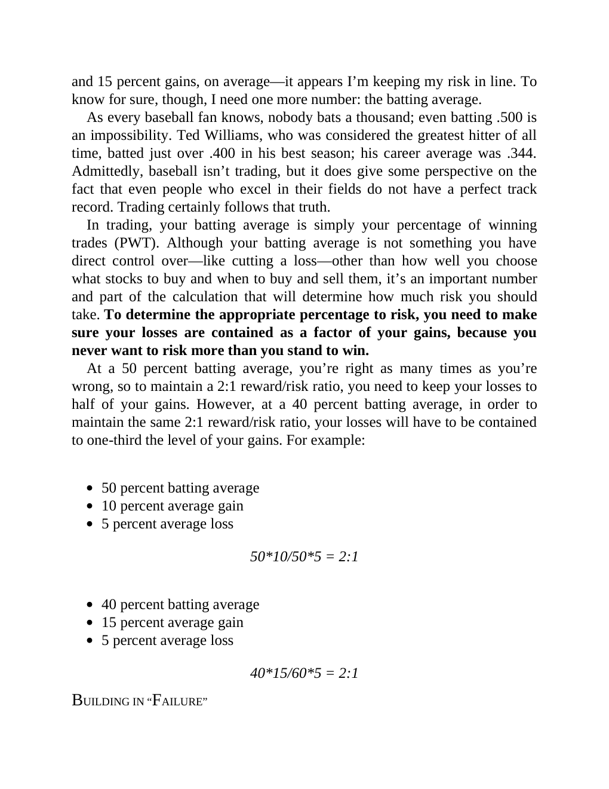

# Think and Trade Like a Champion - Page Image 53

## Source Page

Book: [[Think and Trade Like a Champion]]

## Page Read

Tags: risk-first, sell-or-failure, text-or-context-page

Concepts: [[Risk First]], [[Sell Rules and Failure Signals]]

This page is mainly text/context. It is included so the image index has complete source coverage, but it should not be treated as an independent chart pattern.

## Linked Stock Figures

- No extracted stock-figure case on this page.

## Extracted Page Text Signal

and 15 percent gains, on average-it appears I’m keeping my risk in line. To know for sure, though, I need one more number: the batting average. As every baseball fan knows, nobody bats a thousand; even batting .500 is an impossibility. Ted Williams, who was considered the greatest hitter of all time, batted just over .400 in his best season; his career average was .344. Admittedly, baseball isn’t trading, but it does give some perspective on the fact that even people who excel in their fields do...

## Manual Study Prompt

- What visual structure is the page trying to make obvious?
- Is the lesson about buying, avoiding, selling, or managing risk?
- If a ticker is not present, what generic behavior does the image teach?
- If a ticker is present, does the linked OHLCV rebuild confirm the same behavior?
