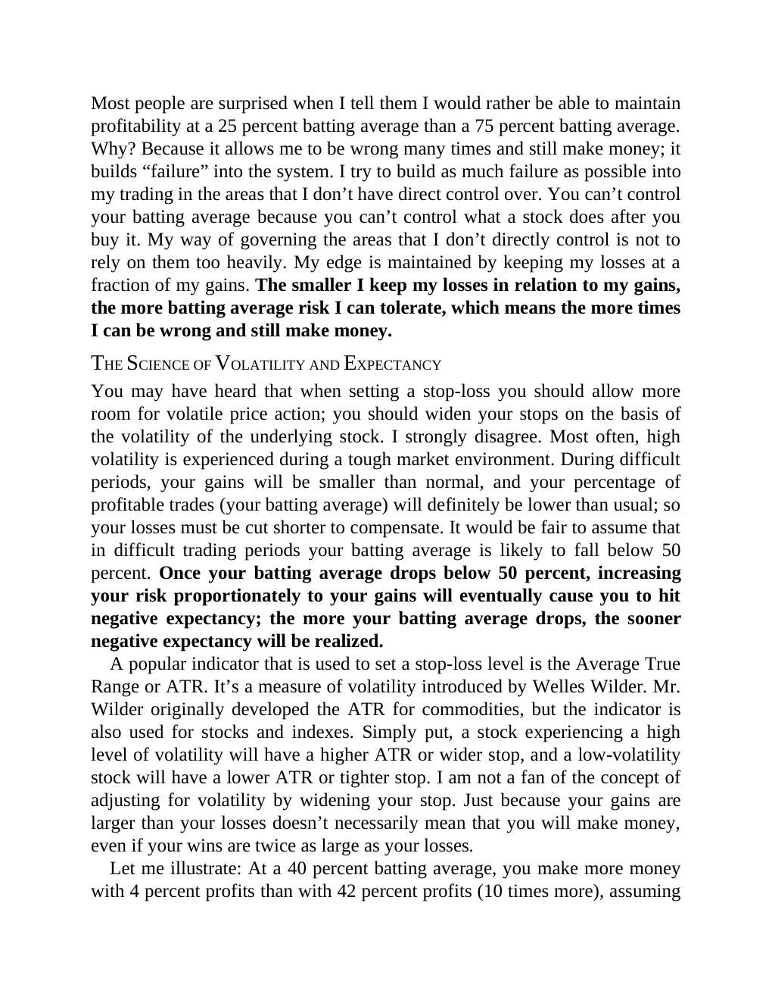

# Think and Trade Like a Champion - Page Image 54

## Source Page

Book: [[Think and Trade Like a Champion]]

## Page Read

Tags: risk-first, sell-or-failure, text-or-context-page

Concepts: [[Risk First]], [[Sell Rules and Failure Signals]]

This page is mainly text/context. It is included so the image index has complete source coverage, but it should not be treated as an independent chart pattern.

## Linked Stock Figures

- No extracted stock-figure case on this page.

## Extracted Page Text Signal

Most people are surprised when I tell them I would rather be able to maintain profitability at a 25 percent batting average than a 75 percent batting average. Why? Because it allows me to be wrong many times and still make money; it builds “failure” into the system. I try to build as much failure as possible into my trading in the areas that I don’t have direct control over. You can’t control your batting average because you can’t control what a stock does after you buy it. My way of governing t...

## Manual Study Prompt

- What visual structure is the page trying to make obvious?
- Is the lesson about buying, avoiding, selling, or managing risk?
- If a ticker is not present, what generic behavior does the image teach?
- If a ticker is present, does the linked OHLCV rebuild confirm the same behavior?
