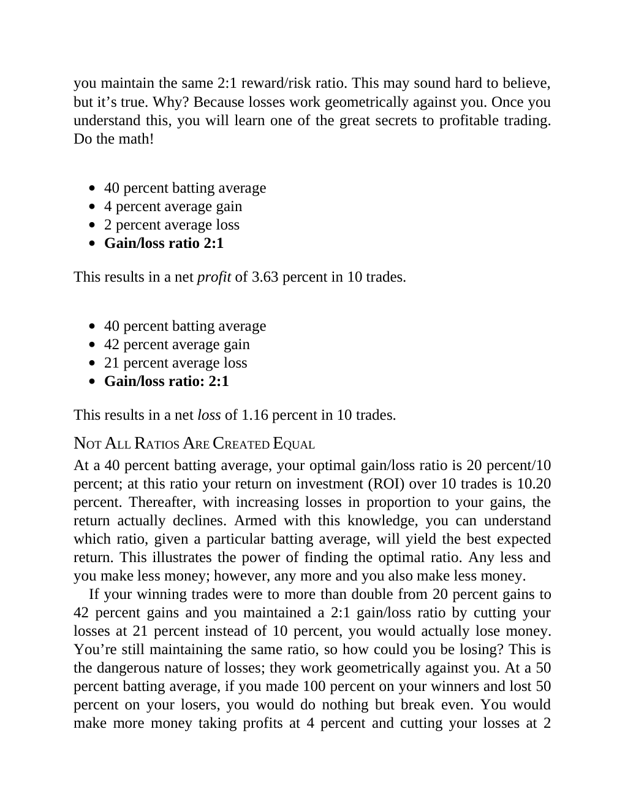

# Think and Trade Like a Champion - Page Image 55

## Source Page

Book: [[Think and Trade Like a Champion]]

## Page Read

Tags: risk-first, text-or-context-page

Concepts: [[Risk First]]

This page is mainly text/context. It is included so the image index has complete source coverage, but it should not be treated as an independent chart pattern.

## Linked Stock Figures

- No extracted stock-figure case on this page.

## Extracted Page Text Signal

you maintain the same 2:1 reward/risk ratio. This may sound hard to believe, but it’s true. Why? Because losses work geometrically against you. Once you understand this, you will learn one of the great secrets to profitable trading. Do the math! 40 percent batting average 4 percent average gain 2 percent average loss Gain/loss ratio 2:1 This results in a net profit of 3.63 percent in 10 trades. 40 percent batting average 42 percent average gain 21 percent average loss Gain/loss ratio: 2:1 This r...

## Manual Study Prompt

- What visual structure is the page trying to make obvious?
- Is the lesson about buying, avoiding, selling, or managing risk?
- If a ticker is not present, what generic behavior does the image teach?
- If a ticker is present, does the linked OHLCV rebuild confirm the same behavior?
