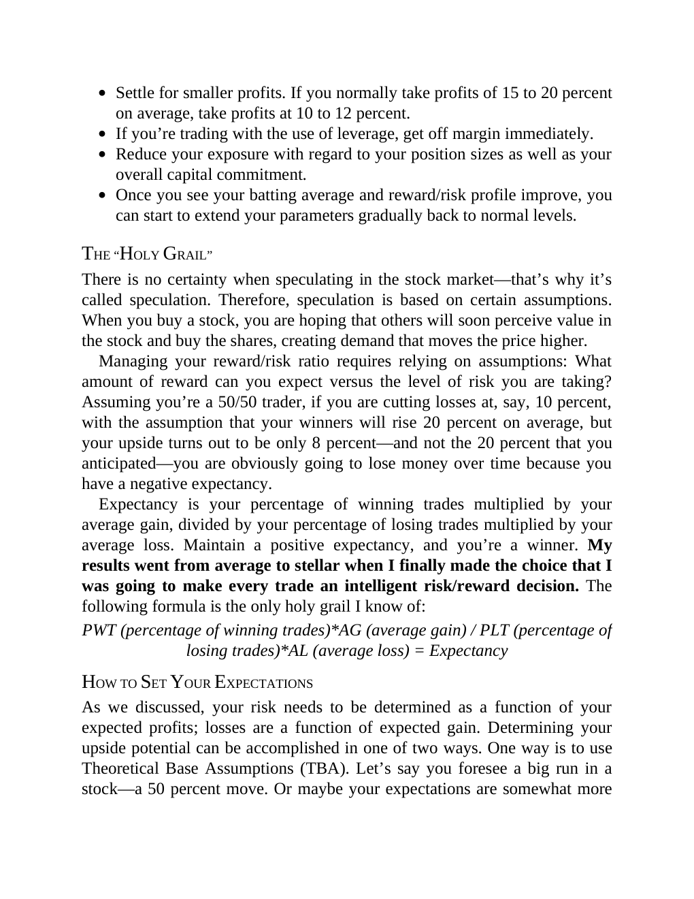

# Think and Trade Like a Champion - Page Image 57

## Source Page

Book: [[Think and Trade Like a Champion]]

## Page Read

Tags: risk-first, text-or-context-page

Concepts: [[Risk First]]

This page is mainly text/context. It is included so the image index has complete source coverage, but it should not be treated as an independent chart pattern.

## Linked Stock Figures

- No extracted stock-figure case on this page.

## Extracted Page Text Signal

Settle for smaller profits. If you normally take profits of 15 to 20 percent on average, take profits at 10 to 12 percent. If you’re trading with the use of leverage, get off margin immediately. Reduce your exposure with regard to your position sizes as well as your overall capital commitment. Once you see your batting average and reward/risk profile improve, you can start to extend your parameters gradually back to normal levels. THE “HOLY GRAIL” There is no certainty when speculating in the st...

## Manual Study Prompt

- What visual structure is the page trying to make obvious?
- Is the lesson about buying, avoiding, selling, or managing risk?
- If a ticker is not present, what generic behavior does the image teach?
- If a ticker is present, does the linked OHLCV rebuild confirm the same behavior?
