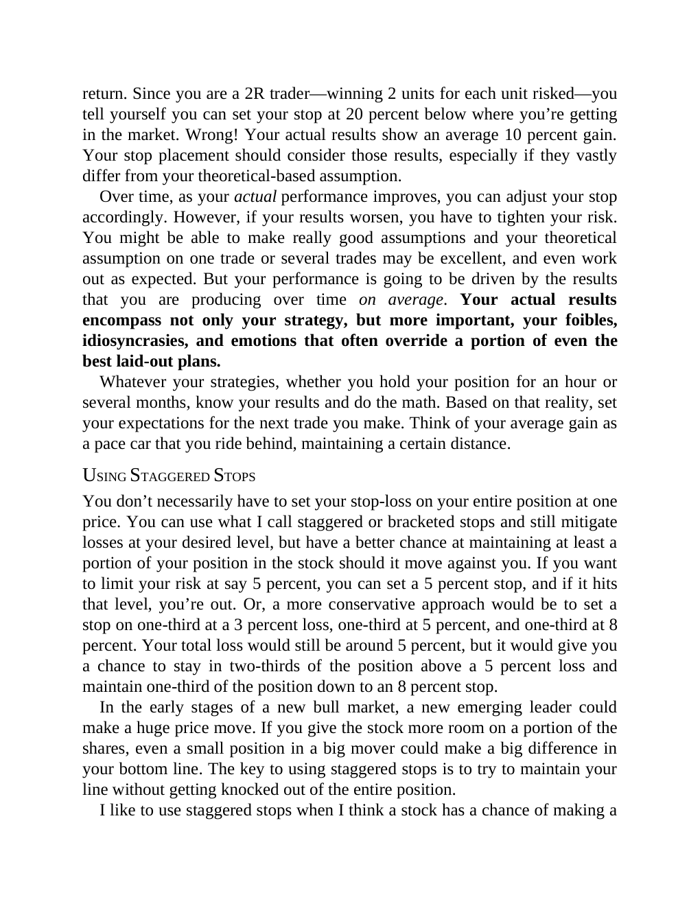

# Think and Trade Like a Champion - Page Image 59

## Source Page

Book: [[Think and Trade Like a Champion]]

## Page Read

Tags: risk-first, text-or-context-page

Concepts: [[Risk First]]

This page is mainly text/context. It is included so the image index has complete source coverage, but it should not be treated as an independent chart pattern.

## Linked Stock Figures

- No extracted stock-figure case on this page.

## Extracted Page Text Signal

return. Since you are a 2R trader-winning 2 units for each unit risked-you tell yourself you can set your stop at 20 percent below where you’re getting in the market. Wrong! Your actual results show an average 10 percent gain. Your stop placement should consider those results, especially if they vastly differ from your theoretical-based assumption. Over time, as your actual performance improves, you can adjust your stop accordingly. However, if your results worsen, you have to tighten your risk....

## Manual Study Prompt

- What visual structure is the page trying to make obvious?
- Is the lesson about buying, avoiding, selling, or managing risk?
- If a ticker is not present, what generic behavior does the image teach?
- If a ticker is present, does the linked OHLCV rebuild confirm the same behavior?
