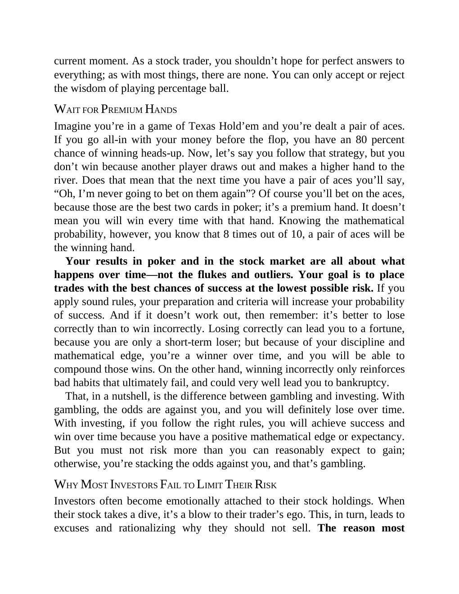

# Think and Trade Like a Champion - Page Image 63

## Source Page

Book: [[Think and Trade Like a Champion]]

## Page Read

Tags: mental-discipline, risk-first, text-or-context-page

Concepts: [[Mental Discipline]], [[Risk First]]

This page is mainly text/context. It is included so the image index has complete source coverage, but it should not be treated as an independent chart pattern.

## Linked Stock Figures

- No extracted stock-figure case on this page.

## Extracted Page Text Signal

current moment. As a stock trader, you shouldn’t hope for perfect answers to everything; as with most things, there are none. You can only accept or reject the wisdom of playing percentage ball. WAIT FOR PREMIUM HANDS Imagine you’re in a game of Texas Hold’em and you’re dealt a pair of aces. If you go all-in with your money before the flop, you have an 80 percent chance of winning heads-up. Now, let’s say you follow that strategy, but you don’t win because another player draws out and makes a hi...

## Manual Study Prompt

- What visual structure is the page trying to make obvious?
- Is the lesson about buying, avoiding, selling, or managing risk?
- If a ticker is not present, what generic behavior does the image teach?
- If a ticker is present, does the linked OHLCV rebuild confirm the same behavior?
