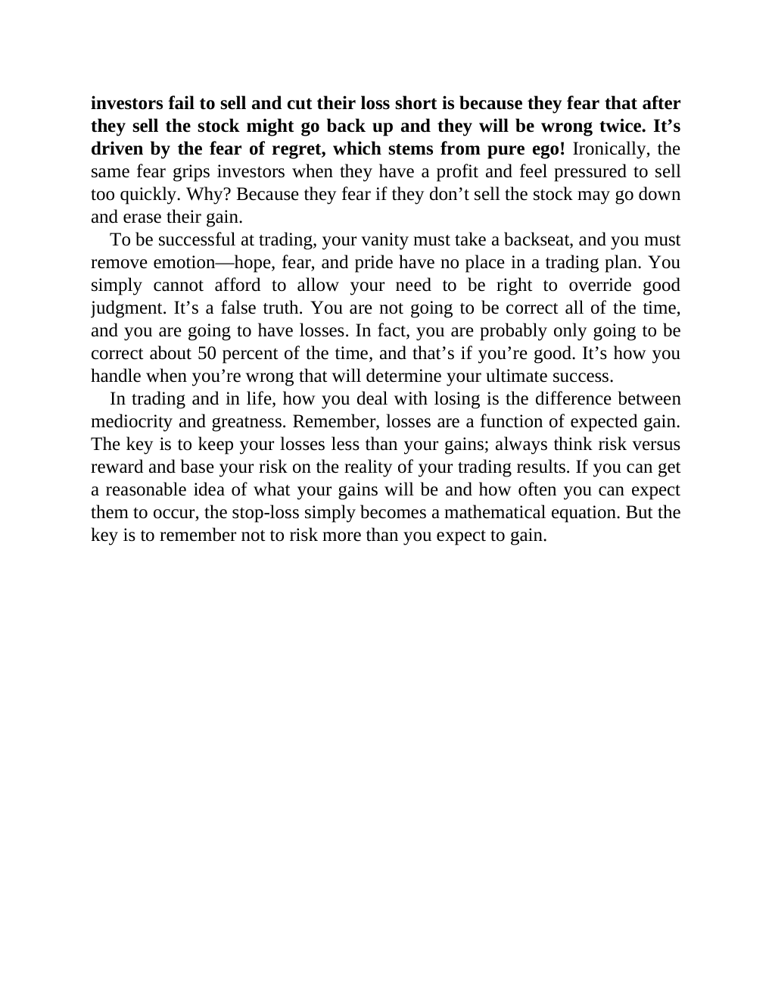

# Think and Trade Like a Champion - Page Image 64

## Source Page

Book: [[Think and Trade Like a Champion]]

## Page Read

Tags: risk-first, sell-or-failure, text-or-context-page

Concepts: [[Risk First]], [[Sell Rules and Failure Signals]]

This page is mainly text/context. It is included so the image index has complete source coverage, but it should not be treated as an independent chart pattern.

## Linked Stock Figures

- No extracted stock-figure case on this page.

## Extracted Page Text Signal

investors fail to sell and cut their loss short is because they fear that after they sell the stock might go back up and they will be wrong twice. It’s driven by the fear of regret, which stems from pure ego! Ironically, the same fear grips investors when they have a profit and feel pressured to sell too quickly. Why? Because they fear if they don’t sell the stock may go down and erase their gain. To be successful at trading, your vanity must take a backseat, and you must remove emotion-hope, fe...

## Manual Study Prompt

- What visual structure is the page trying to make obvious?
- Is the lesson about buying, avoiding, selling, or managing risk?
- If a ticker is not present, what generic behavior does the image teach?
- If a ticker is present, does the linked OHLCV rebuild confirm the same behavior?
