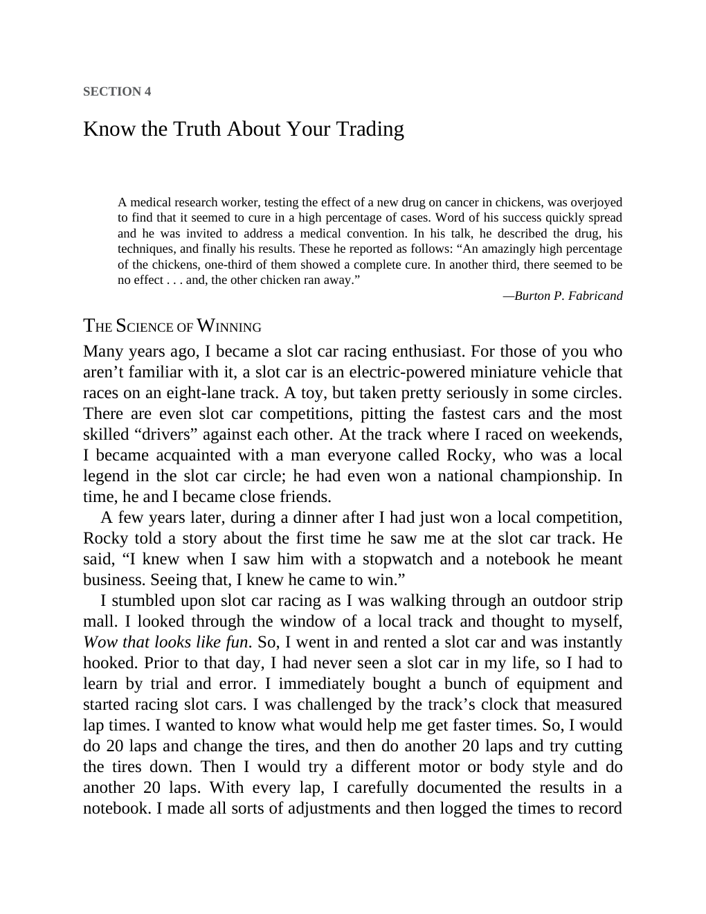

# Think and Trade Like a Champion - Page Image 65

## Source Page

Book: [[Think and Trade Like a Champion]]

## Page Read

Tags: risk-first, text-or-context-page

Concepts: [[Risk First]]

This page is mainly text/context. It is included so the image index has complete source coverage, but it should not be treated as an independent chart pattern.

## Linked Stock Figures

- No extracted stock-figure case on this page.

## Extracted Page Text Signal

SECTION 4 Know the Truth About Your Trading A medical research worker, testing the effect of a new drug on cancer in chickens, was overjoyed to find that it seemed to cure in a high percentage of cases. Word of his success quickly spread and he was invited to address a medical convention. In his talk, he described the drug, his techniques, and finally his results. These he reported as follows: “An amazingly high percentage of the chickens, one-third of them showed a complete cure. In another thi...

## Manual Study Prompt

- What visual structure is the page trying to make obvious?
- Is the lesson about buying, avoiding, selling, or managing risk?
- If a ticker is not present, what generic behavior does the image teach?
- If a ticker is present, does the linked OHLCV rebuild confirm the same behavior?
