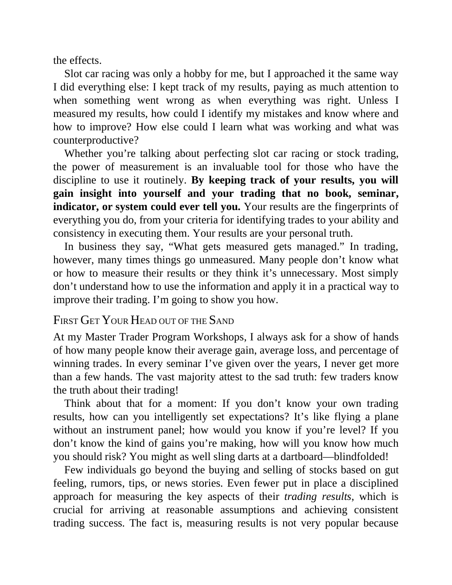

# Think and Trade Like a Champion - Page Image 66

## Source Page

Book: [[Think and Trade Like a Champion]]

## Page Read

Tags: mental-discipline, text-or-context-page

Concepts: [[Mental Discipline]]

This page is mainly text/context. It is included so the image index has complete source coverage, but it should not be treated as an independent chart pattern.

## Linked Stock Figures

- No extracted stock-figure case on this page.

## Extracted Page Text Signal

the effects. Slot car racing was only a hobby for me, but I approached it the same way I did everything else: I kept track of my results, paying as much attention to when something went wrong as when everything was right. Unless I measured my results, how could I identify my mistakes and know where and how to improve? How else could I learn what was working and what was counterproductive? Whether you’re talking about perfecting slot car racing or stock trading, the power of measurement is an inv...

## Manual Study Prompt

- What visual structure is the page trying to make obvious?
- Is the lesson about buying, avoiding, selling, or managing risk?
- If a ticker is not present, what generic behavior does the image teach?
- If a ticker is present, does the linked OHLCV rebuild confirm the same behavior?
