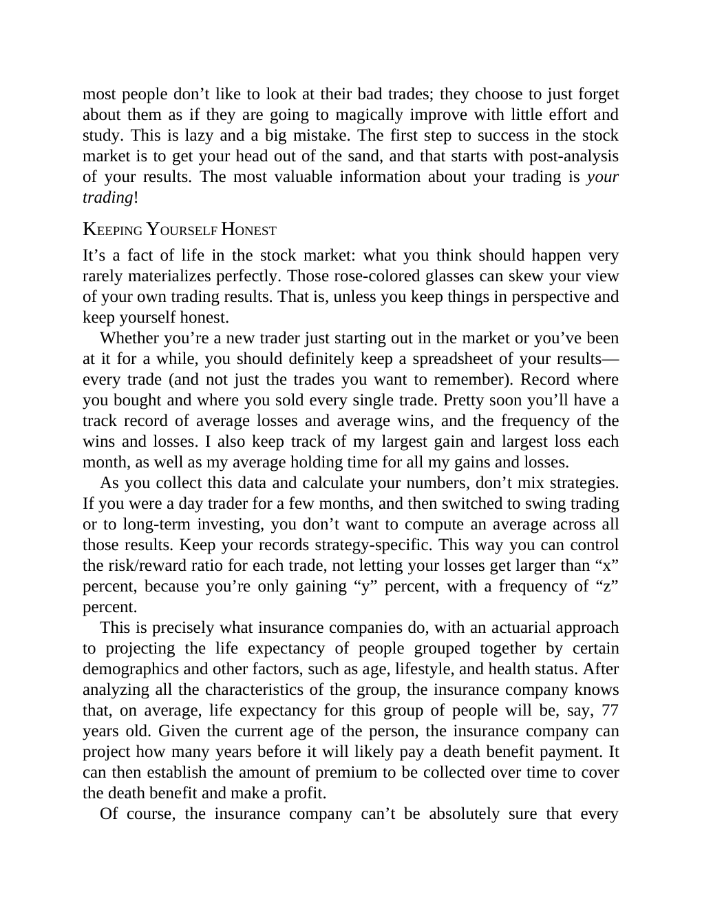

# Think and Trade Like a Champion - Page Image 67

## Source Page

Book: [[Think and Trade Like a Champion]]

## Page Read

Tags: mental-discipline, risk-first, text-or-context-page

Concepts: [[Mental Discipline]], [[Risk First]]

This page is mainly text/context. It is included so the image index has complete source coverage, but it should not be treated as an independent chart pattern.

## Linked Stock Figures

- No extracted stock-figure case on this page.

## Extracted Page Text Signal

most people don’t like to look at their bad trades; they choose to just forget about them as if they are going to magically improve with little effort and study. This is lazy and a big mistake. The first step to success in the stock market is to get your head out of the sand, and that starts with post-analysis of your results. The most valuable information about your trading is your trading! KEEPING YOURSELF HONEST It’s a fact of life in the stock market: what you think should happen very rarely...

## Manual Study Prompt

- What visual structure is the page trying to make obvious?
- Is the lesson about buying, avoiding, selling, or managing risk?
- If a ticker is not present, what generic behavior does the image teach?
- If a ticker is present, does the linked OHLCV rebuild confirm the same behavior?
