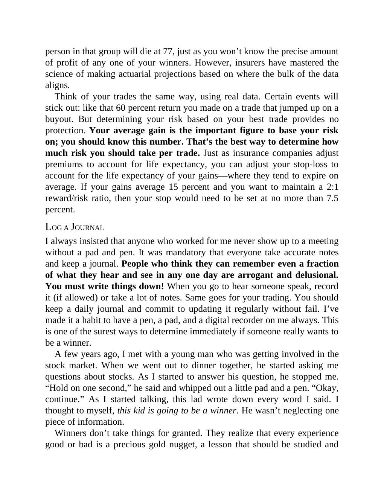

# Think and Trade Like a Champion - Page Image 68

## Source Page

Book: [[Think and Trade Like a Champion]]

## Page Read

Tags: manual-figure-page, risk-first

Concepts: [[Mental Discipline]], [[Risk First]]

This page contains figure language, but the ticker/date was not extractable from the caption text. Treat it as a manual visual case: identify the shape, decide whether it is a buy setup or an avoid/sell lesson, and only promote it to a trade template after a ticker/date can be reconciled.

## Linked Stock Figures

- No extracted stock-figure case on this page.

## Extracted Page Text Signal

person in that group will die at 77, just as you won’t know the precise amount of profit of any one of your winners. However, insurers have mastered the science of making actuarial projections based on where the bulk of the data aligns. Think of your trades the same way, using real data. Certain events will stick out: like that 60 percent return you made on a trade that jumped up on a buyout. But determining your risk based on your best trade provides no protection. Your average gain is the impo...

## Manual Study Prompt

- What visual structure is the page trying to make obvious?
- Is the lesson about buying, avoiding, selling, or managing risk?
- If a ticker is not present, what generic behavior does the image teach?
- If a ticker is present, does the linked OHLCV rebuild confirm the same behavior?
